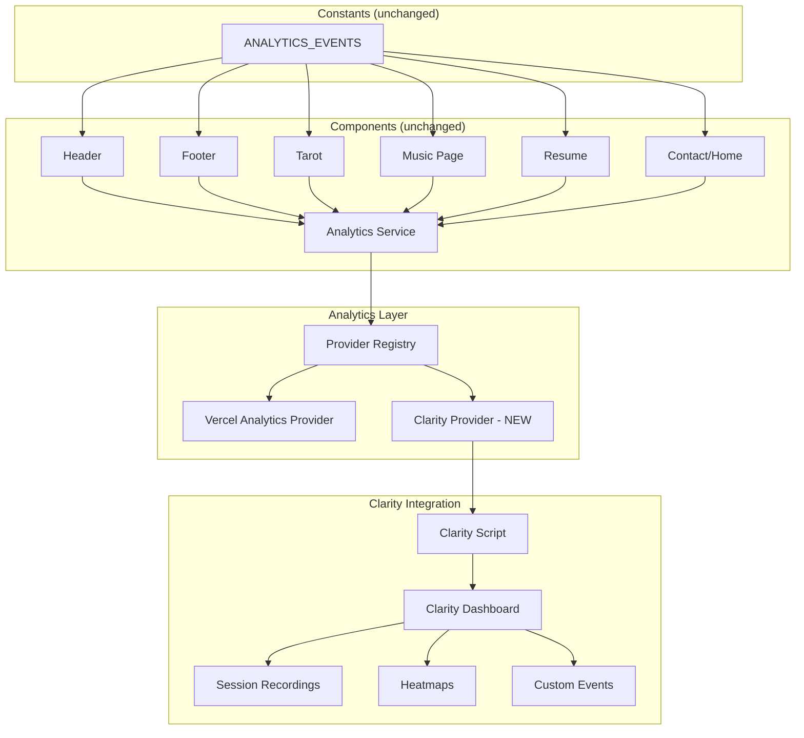

# Design Document: Microsoft Clarity Analytics Integration

## Overview

This design adds Microsoft Clarity as a second analytics provider to the existing provider-agnostic architecture. Clarity provides session recordings, heatmaps, dead click detection, and user flow analysis. The integration is purely additive — a new `clarityProvider` is created, registered with the existing `AnalyticsService`, and the Clarity tracking script is loaded dynamically based on environment configuration.

No existing components, event constants, or tracking calls are modified. The Clarity provider implements the same `{ name, trackEvent }` interface as the Vercel provider. Privacy is enforced by stripping sensitive properties before forwarding events and by enabling Clarity's built-in input masking for session recordings.

## Architecture



The only new code lives in:
1. A Clarity provider module (`clarityProvider.js`)
2. A Clarity script loader utility (`clarityLoader.js`)
3. Updated initialization in `index.js` to conditionally register the Clarity provider

## Components and Interfaces

### Clarity Script Loader

Dynamically injects the Clarity tracking script into the document head. This is a one-time operation at app startup.

```javascript
// src/utils/analytics/providers/clarityLoader.js

/**
 * Dynamically loads the Microsoft Clarity tracking script.
 * @param {string} projectId - The Clarity project identifier
 */
export function loadClarityScript(projectId) {
  (function(c, l, a, r, i, t, y) {
    c[a] = c[a] || function() { (c[a].q = c[a].q || []).push(arguments) }
    t = l.createElement(r)
    t.async = 1
    t.src = 'https://www.clarity.ms/tag/' + i
    y = l.getElementsByTagName(r)[0]
    y.parentNode.insertBefore(t, y)
  })(window, document, 'clarity', 'script', projectId)
}
```

This approach:
- Avoids hardcoding anything in `index.html`
- Uses the official Clarity snippet pattern
- Makes `window.clarity` available for the event API
- Enables session recording and heatmaps automatically once loaded

### Clarity Provider

Implements the existing provider interface. Strips sensitive properties before forwarding.

```javascript
// src/utils/analytics/providers/clarityProvider.js

const SENSITIVE_KEYS = ['question', 'message', 'text', 'content', 'note', 'body']

/**
 * Strips properties that may contain user-entered sensitive content.
 * @param {Record<string, any>} properties
 * @returns {Record<string, any>}
 */
function sanitizeProperties(properties) {
  if (!properties || typeof properties !== 'object') return {}
  const sanitized = {}
  for (const [key, value] of Object.entries(properties)) {
    if (!SENSITIVE_KEYS.includes(key.toLowerCase())) {
      sanitized[key] = value
    }
  }
  return sanitized
}

export const clarityProvider = {
  name: 'clarity',

  trackEvent(eventName, properties) {
    if (typeof window === 'undefined' || typeof window.clarity !== 'function') {
      return
    }
    window.clarity('event', eventName)
  }
}
```

Key decisions:
- The Clarity event API (`window.clarity('event', eventName)`) only accepts event names — it does not support arbitrary properties on custom events. Properties are sanitized but primarily used as a safeguard pattern for future API changes.
- If `window.clarity` is not available (script not loaded, ad blocker, etc.), the provider silently no-ops.
- Sensitive key filtering provides defense-in-depth even though Clarity's event API doesn't transmit properties.

### Updated Initialization

```javascript
// src/utils/analytics/index.js (additions only)
import { analytics } from './analyticsService'
import { vercelProvider } from './providers/vercelProvider'
import { clarityProvider } from './providers/clarityProvider'
import { loadClarityScript } from './providers/clarityLoader'

// Register Vercel (existing, unchanged)
analytics.registerProvider(vercelProvider)

// Conditionally register Clarity
const clarityProjectId = import.meta.env.VITE_CLARITY_PROJECT_ID

if (clarityProjectId) {
  loadClarityScript(clarityProjectId)
  analytics.registerProvider(clarityProvider)
} else {
  console.warn('[Analytics] Microsoft Clarity not configured — VITE_CLARITY_PROJECT_ID is missing.')
}

export { analytics }
export { ANALYTICS_EVENTS } from './events'
```

### Clarity Content Masking

Clarity automatically records user sessions. To protect sensitive input, Clarity's built-in masking must be configured. This is done by adding a `data-clarity-mask="true"` attribute to sensitive form elements in the existing components.

Sensitive elements to mask:
- Tarot question input field
- Contact form message textarea
- Any future text inputs containing personal content

This is a minimal, targeted change to existing component JSX (adding a data attribute), not a structural modification.

## Data Models

### Provider Interface (unchanged)

```javascript
/**
 * @typedef {Object} AnalyticsProvider
 * @property {string} name - Provider identifier
 * @property {(eventName: string, properties?: Record<string, string|number|boolean>) => void} trackEvent
 */
```

### Sensitive Keys List

```javascript
const SENSITIVE_KEYS = ['question', 'message', 'text', 'content', 'note', 'body']
```

A static list of property keys that may contain user-entered content. Used for sanitization before any data leaves the provider boundary.

### Environment Configuration

| Variable | Required | Description |
|----------|----------|-------------|
| `VITE_CLARITY_PROJECT_ID` | No | Microsoft Clarity project ID. If absent, Clarity is skipped. |

### File Structure (extended)

```
src/utils/analytics/
├── index.js                # Updated — conditionally registers Clarity
├── analyticsService.js     # Unchanged
├── events.js               # Unchanged
└── providers/
    ├── vercelProvider.js   # Unchanged
    ├── clarityProvider.js  # NEW — Clarity provider adapter
    └── clarityLoader.js    # NEW — Dynamic script injection
```


## Correctness Properties

*A property is a characteristic or behavior that should hold true across all valid executions of a system — essentially, a formal statement about what the system should do. Properties serve as the bridge between human-readable specifications and machine-verifiable correctness guarantees.*

### Property 1: Script injection uses provided project ID

*For any* valid project ID string, calling `loadClarityScript(projectId)` should inject a script element into the document whose `src` attribute contains that exact project ID.

**Validates: Requirements 1.1, 1.5**

### Property 2: Event forwarding to Clarity API

*For any* event name string, when `window.clarity` is available and `clarityProvider.trackEvent(eventName)` is called, `window.clarity` should be invoked with arguments `('event', eventName)`.

**Validates: Requirements 2.2**

### Property 3: Silent failure when Clarity is unavailable

*For any* event name and properties, when `window.clarity` is undefined or not a function, calling `clarityProvider.trackEvent(eventName, properties)` should not throw an error.

**Validates: Requirements 2.3**

### Property 4: Sensitive property sanitization

*For any* properties object containing keys from the sensitive keys list (`question`, `message`, `text`, `content`, `note`, `body`), the `sanitizeProperties` function should return an object that does not contain any of those keys, while preserving all non-sensitive keys and their values.

**Validates: Requirements 4.1, 4.3, 4.4, 4.5**

### Property 5: Clarity errors do not affect other providers

*For any* event name, when the Clarity provider throws an error during `trackEvent`, all other registered providers (e.g., Vercel) should still receive the event without modification.

**Validates: Requirements 5.1, 5.4**

## Error Handling

| Scenario | Behavior |
|----------|----------|
| `VITE_CLARITY_PROJECT_ID` missing | Clarity skipped entirely; console warning logged; Vercel unaffected |
| Clarity script fails to load (network error, ad blocker) | `window.clarity` never defined; provider no-ops on trackEvent |
| `window.clarity` undefined at trackEvent time | Provider returns silently; no error thrown |
| Clarity provider throws during trackEvent | Caught by AnalyticsService try/catch; other providers still called |
| Invalid project ID format | Script loads but Clarity dashboard won't receive data; no client error |
| Script injection called multiple times | Clarity handles deduplication internally; no adverse effects |

The existing error boundary in `AnalyticsService.trackEvent()` already wraps each provider call in try/catch. The Clarity provider adds a second layer of defense by checking `window.clarity` existence before calling it.

## Testing Strategy

### Unit Tests (Vitest)

Unit tests verify specific integration examples and edge cases:

- `clarityProvider` exports an object with `name` (string) and `trackEvent` (function)
- `loadClarityScript` adds a script element when called with a project ID
- Initialization skips Clarity registration when env var is absent
- Initialization logs a console warning when env var is absent
- `data-clarity-mask` attribute is present on sensitive input elements
- Clarity script is not present in `index.html`

### Property-Based Tests (fast-check + Vitest)

Property tests use `fast-check` to verify universal correctness:

- **Minimum 100 iterations** per property test
- Each test tagged with: `Feature: clarity-analytics, Property N: {title}`

```javascript
// Example property test structure
import { fc } from 'fast-check'
import { describe, it, expect } from 'vitest'
import { sanitizeProperties } from '../src/utils/analytics/providers/clarityProvider'

describe('Clarity Provider Properties', () => {
  // Feature: clarity-analytics, Property 4: Sensitive property sanitization
  it('strips all sensitive keys from properties', () => {
    const sensitiveKeys = ['question', 'message', 'text', 'content', 'note', 'body']

    fc.assert(
      fc.property(
        fc.dictionary(fc.string(), fc.string()),
        (properties) => {
          const sanitized = sanitizeProperties(properties)
          for (const key of sensitiveKeys) {
            expect(sanitized).not.toHaveProperty(key)
          }
          // Non-sensitive keys preserved
          for (const [key, value] of Object.entries(properties)) {
            if (!sensitiveKeys.includes(key.toLowerCase())) {
              expect(sanitized[key]).toBe(value)
            }
          }
        }
      ),
      { numRuns: 100 }
    )
  })
})
```

### Test Coverage Strategy

| Layer | Testing Approach |
|-------|-----------------|
| `sanitizeProperties` function | Property-based test (Property 4) |
| `clarityProvider.trackEvent` forwarding | Property-based test (Property 2) |
| `clarityProvider.trackEvent` silent failure | Property-based test (Property 3) |
| `loadClarityScript` injection | Property-based test (Property 1) |
| Multi-provider error isolation | Property-based test (Property 5) |
| Provider interface shape | Unit test |
| Conditional initialization logic | Unit test |
| Content masking attributes | Unit test |
