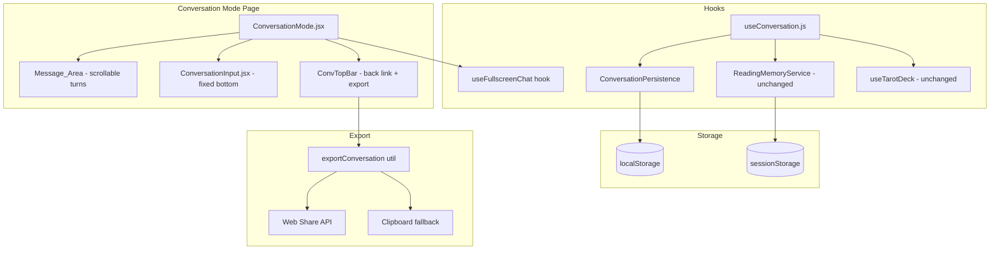

# Design Document: Conversation Mode Mobile UX

## Overview

This design transforms the Tarot Conversation Mode into a full-screen mobile chat experience. The key architectural changes are:

1. **Layout shift on mobile**: The conversation page becomes a full-viewport experience (`100dvh`) with no site header/nav. The page itself scrolls (body-level scroll on mobile) with a fixed input bar at the bottom.
2. **Input positioning**: The Input_Bar uses `position: fixed` on mobile (pinned to bottom of visual viewport) and `position: sticky` on desktop. VisualViewport API handles keyboard avoidance on iOS.
3. **Persistence migration**: Conversation turns move from in-memory `useState` (lost on refresh) to localStorage-backed state. The existing `ReadingMemoryService` (sessionStorage-based) remains untouched for Gemini context history — a new `ConversationPersistence` module handles turn persistence separately.
4. **Export**: A simple text formatter produces shareable conversation summaries, using Web Share API where available or clipboard fallback.

## Architecture



### Mobile Layout Strategy

On mobile (viewport < 640px):
- The `ConversationMode` sets `document.body` styles to hide the header/nav (the page layout component will respect a class or route-based condition)
- The page uses natural document flow — turns stack in the document and the whole page scrolls
- Input_Bar is `position: fixed; bottom: 0` so it stays visible regardless of scroll position
- Bottom padding on the message area equals the Input_Bar height to prevent content from being hidden behind it

On desktop (viewport ≥ 640px):
- Standard layout with header visible
- Conversation uses a flex column with overflow scroll in the message container
- Input_Bar uses `position: sticky; bottom: 0`

### Keyboard Handling (iOS)

The existing `visualViewport` logic in `ConversationInput.jsx` is already partially correct. The design keeps this approach:
- Listen to `visualViewport.resize` and `visualViewport.scroll` events
- Compute offset as `window.innerHeight - visualViewport.height - visualViewport.offsetTop`
- Apply `bottom` offset to the fixed Input_Bar when keyboard is open

## Components and Interfaces

### Modified Components

#### ConversationMode.jsx
- Accepts `turns` from the hook (now localStorage-backed)
- On mobile: renders as a simple stacked list (no fixed-height container, page scrolls)
- On desktop: keeps the current flex-column layout with scrollable message area
- Adds export button to convTopBar
- Uses `useFullscreenChat` hook to manage header hiding on mobile

#### ConversationInput.jsx
- `position: fixed` on mobile, `position: sticky` on desktop
- Continues using `visualViewport` API for keyboard offset
- Auto-expand behavior unchanged (already implemented with MAX_ROWS = 6)
- Reports its rendered height so parent can set bottom padding

#### ConversationTurn.jsx
- Unchanged in functionality
- Cards within a turn render in a horizontal scroll container on mobile

#### Spread.jsx (within conversation turns)
- On mobile: horizontal scroll with `overflow-x: auto`, min card width 120px
- Preserves current grid/flex on desktop

### New Modules

#### useFullscreenChat.js (hook)
```javascript
interface UseFullscreenChatReturn {
  isMobile: boolean          // true when viewport < 640px
  inputBarHeight: number     // current height of the input bar for padding calc
  setInputBarHeight: (h: number) => void
}
```
- Manages a media query listener for `(max-width: 639px)`
- On mobile mount: adds a class to `document.documentElement` to hide the header
- On unmount or desktop: removes the class
- Tracks input bar height for bottom padding

#### ConversationPersistence.js (service)
```javascript
interface ConversationPersistence {
  loadTurns(): Turn[]
  saveTurns(turns: Turn[]): void
  clear(): void
}
```
- Uses localStorage key `tarot_conversation_history` (distinct from `tarot_conversation_session` in ReadingMemoryService)
- Serializes/deserializes the full turns array as JSON
- Graceful fallback: returns empty array if localStorage is unavailable or data is corrupt

#### exportConversation.js (utility)
```javascript
interface ExportOptions {
  turns: Turn[]
  format: 'text'   // future: 'json', 'markdown'
}

function formatConversationExport(turns: Turn[]): string
async function shareConversation(text: string): Promise<{method: 'share' | 'clipboard'}>
```
- `formatConversationExport`: produces a human-readable text block
- `shareConversation`: tries `navigator.share()`, falls back to `navigator.clipboard.writeText()`

### CSS Changes (Tarot.module.scss)

Key changes to conversation styles:
- `.convWrapper`: on mobile, remove `height: 90dvh` and `overflow: hidden`; let it be `min-height: 100dvh` with natural flow
- `.convMessages`: on mobile, remove `overflow-y: auto` and `flex: 1`; just stack content with padding-bottom
- `.convInputBar`: on mobile, `position: fixed; bottom: 0; left: 0; right: 0; z-index: 100`
- Add `html` class `.fullscreen-chat` that hides the site header (`display: none`)
- Cards in `.spread` within conversation: `overflow-x: auto; flex-wrap: nowrap` on mobile

## Data Models

### Turn (existing, unchanged structure)
```javascript
{
  id: string,               // crypto.randomUUID()
  timestamp: string,        // ISO 8601
  question: string,
  cards: DrawnCard[],        // { card, isReversed, position }
  spreadPreset: SpreadPreset,
  interpretation: GeminiInterpretation | null,
  fallbackInterpretation: FallbackInterpretation | null,
  error: string | null
}
```

### localStorage Schema
```javascript
// Key: 'tarot_conversation_history'
{
  version: 1,
  turns: Turn[],
  lastUpdated: string   // ISO 8601 timestamp
}
```

### Export Text Format
```
🔮 Tarot Conversation - [date]
━━━━━━━━━━━━━━━━━━━━━━━━━━━━━━

🙋 You asked: [question]
📅 [timestamp]
🃏 Cards: [card1 name] (Position: [pos], Reversed: yes/no), ...

✨ Interpretation:
[summary text]

---
[repeat for each turn]
```

