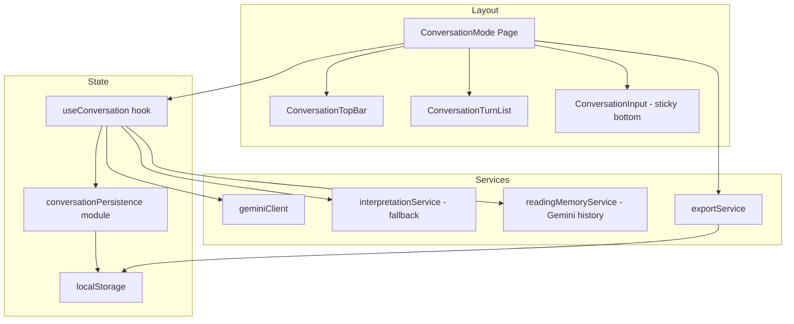

# Design Document: Conversation Mode UX Fix

## Overview

This design transforms the Conversation Mode from a fixed-viewport scrolling container into a full-page, chat-like interface. The key architectural shift is moving from an inner `overflow-y: auto` container to using the document body as the scroll container, with a `position: sticky` input bar at the bottom. Conversation state moves from in-memory (lost on refresh) to localStorage-persisted, and an export service is added.

The design preserves existing Gemini integration, card drawing logic, and fallback interpretation — only the presentation layer, persistence layer, and a new export module are affected.

## Architecture



**Key architectural decisions:**

1. **Document-level scroll instead of inner container**: The `.convMessages` div loses `overflow-y: auto` and `flex: 1`. Instead, the page body scrolls naturally. The input bar uses `position: sticky; bottom: 0` to stay anchored.

2. **Header hiding via route-aware class**: The main layout adds a CSS class to hide the header when on `/tarot/conversation` at mobile widths, using a media query. No JS toggling needed — pure CSS based on a body/root class.

3. **localStorage persistence separate from ReadingMemoryService**: The existing `ReadingMemoryService` manages Gemini conversation history in sessionStorage. A new `conversationPersistence` module handles full turn persistence (with cards, interpretations) in localStorage. These remain separate concerns.

4. **Scroll-aware auto-scroll**: Track whether the user is "at bottom" (within a threshold). Only auto-scroll on new turns if user is already at the bottom.

## Components and Interfaces

### Modified Components

#### `ConversationMode.jsx`
- Remove the fixed-height wrapper (`height: 90dvh`, `overflow: hidden`)
- Remove `messagesContainerRef` for scroll management on inner container
- Add scroll-position tracking on `window` to determine "at bottom" state
- Render `ConversationTopBar`, turn list, and sticky input
- Accept restored turns from persistence on mount
- Trigger export via `exportService`

```jsx
// Pseudocode structure
const ConversationMode = () => {
  const { turns, isLoading, submitQuestion, clearConversation } = useConversation({ resetAndDraw })
  const isAtBottom = useIsAtBottom()  // custom hook tracking window scroll

  useEffect(() => {
    if (isAtBottom) window.scrollTo({ top: document.body.scrollHeight, behavior: 'smooth' })
  }, [turns.length])

  return (
    <div className={css.convPage}>
      <ConversationTopBar onExport={handleExport} onClear={clearConversation} hasTurns={turns.length > 0} />
      <div className={css.convTurnList}>
        {turns.map(t => <ConversationTurn key={t.id} turn={t} />)}
        {isLoading && <LoadingTurn />}
      </div>
      <ConversationInput onSubmit={handleSubmit} disabled={isLoading} />
    </div>
  )
}
```

#### `ConversationInput.jsx`
- Keep existing auto-expand logic (already works well)
- Replace `translateY` transform hack with reliance on `position: sticky` and `env(safe-area-inset-bottom)` padding
- Keep `visualViewport` listener as a fallback for older iOS versions
- The sticky positioning handles keyboard avoidance natively on modern iOS (Safari 15+)

#### `ConversationTurn.jsx`
- Add responsive card display: horizontal scroll container on mobile, flex-wrap on desktop
- Cards render as compact thumbnails within the turn (smaller than the full Spread component)

#### `useConversation.js` hook
- Initialize `turns` state from `conversationPersistence.load()` instead of empty array
- After each turn completes, call `conversationPersistence.save(turns)`
- Add `clearConversation()` method that resets state and calls `conversationPersistence.clear()`

### New Modules

#### `conversationPersistence.js`
```javascript
const STORAGE_KEY = 'tarot_conversation_turns'

export const conversationPersistence = {
  save(turns) {
    try {
      const serializable = turns.map(turn => ({
        id: turn.id,
        timestamp: turn.timestamp,
        question: turn.question,
        cards: turn.cards.map(c => ({
          name: c.card.name,
          image: c.card.image,
          reversed: c.isReversed,
          meaning: c.isReversed ? c.card.reversedMeaning : c.card.meaning,
        })),
        spreadPreset: { name: turn.spreadPreset.name, cardCount: turn.spreadPreset.cardCount },
        interpretation: turn.interpretation || null,
        fallbackInterpretation: turn.fallbackInterpretation || null,
      }))
      localStorage.setItem(STORAGE_KEY, JSON.stringify(serializable))
    } catch (e) { /* quota exceeded or unavailable — silent fail */ }
  },

  load() {
    try {
      const raw = localStorage.getItem(STORAGE_KEY)
      if (!raw) return []
      const data = JSON.parse(raw)
      if (!Array.isArray(data)) return []
      return data
    } catch (e) {
      localStorage.removeItem(STORAGE_KEY)
      return []
    }
  },

  clear() {
    try { localStorage.removeItem(STORAGE_KEY) } catch (e) { /* no-op */ }
  }
}
```

#### `exportService.js`
```javascript
export function exportConversation(turns) {
  if (!turns || turns.length === 0) return

  const lines = turns.map((turn, i) => {
    const cardNames = turn.cards.map(c =>
      `${c.name}${c.reversed ? ' (Reversed)' : ''}`
    ).join(', ')

    let interp = ''
    if (turn.interpretation) {
      interp = [
        turn.interpretation.summary,
        turn.interpretation.detailed,
        turn.interpretation.themes,
      ].filter(Boolean).join('\n')
    } else if (turn.fallbackInterpretation) {
      interp = turn.fallbackInterpretation.summary || ''
    }

    return `--- Turn ${i + 1} ---\nQ: ${turn.question}\nCards: ${cardNames}\n\n${interp}`
  }).join('\n\n')

  const date = new Date().toISOString().slice(0, 10)
  const blob = new Blob([lines], { type: 'text/plain' })
  const url = URL.createObjectURL(blob)
  const a = document.createElement('a')
  a.href = url
  a.download = `tarot-conversation-${date}.txt`
  a.click()
  URL.revokeObjectURL(url)
}
```

#### `useIsAtBottom.js` hook
```javascript
import { useState, useEffect } from 'react'

const THRESHOLD = 100  // px from bottom

export function useIsAtBottom() {
  const [isAtBottom, setIsAtBottom] = useState(true)

  useEffect(() => {
    const check = () => {
      const scrollBottom = window.innerHeight + window.scrollY
      const docHeight = document.documentElement.scrollHeight
      setIsAtBottom(docHeight - scrollBottom < THRESHOLD)
    }
    window.addEventListener('scroll', check, { passive: true })
    check()
    return () => window.removeEventListener('scroll', check)
  }, [])

  return isAtBottom
}
```

### CSS Architecture Changes

#### Header Hiding Strategy

Add a class to the page/body that signals conversation mode is active. Use CSS to hide the header at mobile widths:

```scss
// In a global or layout-level stylesheet
.conversationActive {
  @media (max-width: 639px) {
    .header-wrapper { display: none; }
  }
}
```

The route-level component adds/removes this class on the `<body>` element via `useEffect`.

#### Conversation Layout (replacing current fixed-viewport approach)

```scss
.convPage {
  display: flex;
  flex-direction: column;
  min-height: 100dvh;
  padding-bottom: 80px; // space for sticky input
}

.convTurnList {
  flex: 1;
  padding: 1rem;
  display: flex;
  flex-direction: column;
  gap: 1rem;

  @media (min-width: $sm) {
    max-width: 720px;
    margin: 0 auto;
    padding: 1.5rem;
  }
}

.convInputBar {
  position: sticky;
  bottom: 0;
  z-index: 10;
  padding: 0.75rem 1rem;
  padding-bottom: max(0.75rem, env(safe-area-inset-bottom));
  background: white;
  border-top: 1px solid rgba(13, 47, 63, 0.1);
}
```

## Data Models

### Persisted Turn (localStorage schema)

```typescript
interface PersistedTurn {
  id: string                    // UUID
  timestamp: string             // ISO 8601
  question: string
  cards: PersistedCard[]
  spreadPreset: { name: string; cardCount: number }
  interpretation: Interpretation | null
  fallbackInterpretation: FallbackInterpretation | null
}

interface PersistedCard {
  name: string
  image: string                 // asset path for re-rendering
  reversed: boolean
  meaning: string
}

interface Interpretation {
  summary?: string
  detailed?: string
  themes?: string
  reflectionQuestions?: string
  actionableInsights?: string
}

interface FallbackInterpretation {
  summary: string
  reflections: string[]
  connections: string
}
```

### Export Format

Plain text with clear delimiters:
```
--- Turn 1 ---
Q: What should I focus on this week?
Cards: The Fool, Three of Cups (Reversed), The Star

[interpretation text]

--- Turn 2 ---
Q: Can you elaborate on The Star's message?
Cards: ...
```


## Correctness Properties

*A property is a characteristic or behavior that should hold true across all valid executions of a system — essentially, a formal statement about what the system should do. Properties serve as the bridge between human-readable specifications and machine-verifiable correctness guarantees.*

### Property 1: Textarea height is bounded by content lines

*For any* text input containing N newline characters (producing N+1 lines), the textarea's rendered height SHALL equal `min(N+1, 6)` rows worth of line-height. The height never exceeds the 6-row maximum and never drops below 1 row while content is present.

**Validates: Requirements 2.3, 3.2, 3.3**

### Property 2: Submit resets textarea to initial state

*For any* non-empty textarea content, after submission the textarea content SHALL be empty and the textarea height SHALL equal exactly 1 row.

**Validates: Requirements 2.4, 3.4**

### Property 3: Turn list integrity (append-only, chronological)

*For any* sequence of N submitted questions, the conversation turn list SHALL contain exactly N turns, each turn SHALL contain its original question text, and the turns SHALL be ordered such that for all i < j, `turns[i].timestamp <= turns[j].timestamp`.

**Validates: Requirements 4.1, 4.2**

### Property 4: Fallback turns are appended on API failure

*For any* question submission where the Gemini API call fails, the conversation turn list SHALL still grow by one, and the appended turn SHALL contain a non-null `fallbackInterpretation` field.

**Validates: Requirements 4.4**

### Property 5: Persistence round-trip

*For any* valid array of conversation turns, calling `save(turns)` followed by `load()` SHALL return an array of turns where each turn's `id`, `question`, `cards`, and `interpretation`/`fallbackInterpretation` are equivalent to the original.

**Validates: Requirements 5.1, 5.2**

### Property 6: Corrupted localStorage produces empty state

*For any* invalid string stored in the localStorage key (including malformed JSON, non-array values, empty strings, and random byte sequences), calling `load()` SHALL return an empty array without throwing an exception.

**Validates: Requirements 5.3**

### Property 7: Export serialization contains all turn data

*For any* non-empty array of conversation turns, the serialized export string SHALL contain every turn's question text and every card name from every turn.

**Validates: Requirements 6.2**

### Property 8: Auto-scroll respects user scroll position

*For any* scroll state where `(document.scrollHeight - window.scrollY - window.innerHeight) > THRESHOLD`, adding a new turn SHALL NOT trigger an auto-scroll (scroll position remains unchanged).

**Validates: Requirements 8.4**

## Error Handling

| Scenario | Handling |
|----------|----------|
| localStorage unavailable (private browsing) | Silent fallback to in-memory only; conversation works but doesn't persist |
| localStorage quota exceeded | Catch the error, continue with in-memory state, warn via console |
| Corrupted localStorage JSON | Discard data, remove key, start fresh (Property 6) |
| Gemini API failure | Generate fallback interpretation, append turn normally (Property 4) |
| visualViewport API unavailable | Input bar relies on `position: sticky` + `env(safe-area-inset-bottom)` which handles most cases |
| Export with no turns | Export button disabled; no-op if called programmatically |

## Testing Strategy

### Property-Based Testing

Library: **fast-check** (JavaScript property-based testing library, well-suited for React/Vite projects)

Each property test will run a minimum of 100 iterations with randomly generated inputs.

Properties to implement:
- Property 1: Generate random strings with 0–20 newlines, verify computed height
- Property 2: Generate random non-empty strings, simulate submit, verify reset
- Property 3: Generate random sequences of 1–20 question strings, verify list integrity
- Property 4: Generate random questions with forced API failure, verify fallback turn
- Property 5: Generate random turn arrays, round-trip through save/load
- Property 6: Generate random/malformed strings, store in localStorage, verify safe load
- Property 7: Generate random turn arrays, serialize, verify all data present in output
- Property 8: Generate random scroll positions above threshold, verify no auto-scroll

Each test will be tagged: **Feature: conversation-mode-ux-fix, Property {N}: {title}**

### Unit Tests

Unit tests complement property tests for specific examples and edge cases:
- Empty conversation renders welcome state
- Export button disabled when no turns exist
- Header hidden at viewport < 640px in conversation mode
- Clear conversation resets both state and localStorage
- Textarea starts at 1 row height
- Submit button disabled during loading state

### Integration Tests

- Full flow: submit question → cards drawn → interpretation received → turn rendered → persisted
- Refresh simulation: persist turns → remount component → turns restored
- Export: submit multiple turns → export → verify file content
