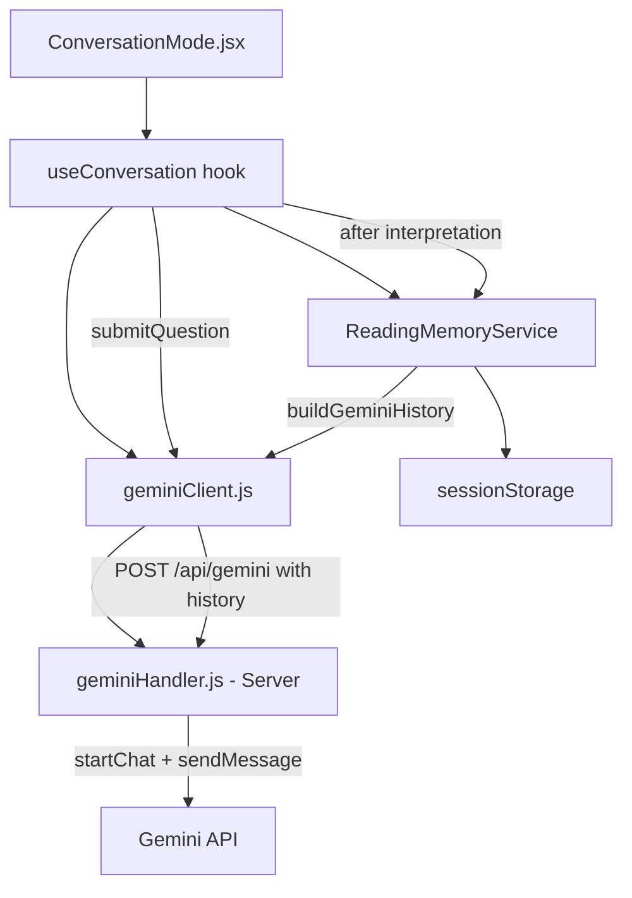

# Design Document: Gemini Conversation Continuity

## Overview

This design adds multi-turn conversation continuity to the existing Tarot Conversation Mode by leveraging Gemini's `startChat({ history })` API. The core change is moving from stateless `generateContent()` calls to stateful chat sessions where previous exchanges are included as history. A new `ReadingMemoryService` encapsulates all memory management — storing condensed reading summaries, managing conversation turns, constructing bounded Gemini history arrays, and persisting session data to sessionStorage.

The design prioritizes token efficiency by never sending full interpretation texts in history, instead using short thematic summaries (≤100 words) and capping context at 6 recent turns + 3 reading summaries.

## Architecture



### Flow for a Follow-Up Question

1. User submits question in `ConversationInput`
2. `useConversation.submitQuestion()` is called
3. Cards are drawn via `resetAndDraw()`
4. `ReadingMemoryService.buildGeminiHistory()` constructs bounded history
5. `geminiClient.callGemini()` sends payload including `history` array to server
6. `geminiHandler` receives request, calls `startChat({ history })` then `chat.sendMessage(currentMessage)`
7. Response returns; `useConversation` stores the turn
8. `ReadingMemoryService.saveReading()` generates and stores a condensed summary
9. Turns and summaries are persisted to sessionStorage

## Components and Interfaces

### ReadingMemoryService

Location: `src/components/Tarot/services/readingMemoryService.js`

```javascript
/**
 * ReadingMemoryService - Manages condensed reading history and conversation turns.
 * Standalone module, no React dependency.
 */

const TURN_LIMIT = 6
const SUMMARY_LIMIT = 3
const STORAGE_KEY = 'tarot_conversation_session'

class ReadingMemoryService {
  constructor() {
    this.turns = []        // Array<{ role: 'user'|'model', content: string, timestamp: string }>
    this.summaries = []    // Array<{ question: string, cards: string[], summary: string }>
    this._restoreFromStorage()
  }

  saveReading(reading) {
    // reading: { question, cards: [{name, reversed}], interpretationText }
    // Generates condensed summary and stores it
  }

  getSessionHistory() {
    // Returns all conversation turns
    return [...this.turns]
  }

  getRecentReadingSummaries() {
    // Returns last SUMMARY_LIMIT reading summaries
    return this.summaries.slice(-SUMMARY_LIMIT)
  }

  buildGeminiHistory() {
    // Constructs the history array for startChat()
    // Format: [{ role, parts: [{ text }] }]
  }

  addTurn(role, content) {
    // Adds a conversation turn and persists to sessionStorage
  }

  _restoreFromStorage() {
    // Restores session from sessionStorage if available
  }

  _persistToStorage() {
    // Saves current state to sessionStorage
  }

  clear() {
    // Clears all state and sessionStorage
  }
}
```

### Updated geminiClient.js

The client adds an optional `history` field to the payload:

```javascript
export const callGemini = async (payload) => {
  // payload now includes: { question, cards, spreadType, history? }
  // history is the array from buildGeminiHistory()
}
```

### Updated geminiHandler.js (Server)

The handler switches from `generateContent()` to `startChat()` + `sendMessage()`:

```javascript
export default async function handler(req, res) {
  const { question, cards, spreadType, history } = req.body

  const genAI = new GoogleGenerativeAI(apiKey)
  const genModel = genAI.getGenerativeModel({ model, systemInstruction: SYSTEM_PROMPT })

  // Use startChat with provided history (or empty array for first turn)
  const chat = genModel.startChat({ history: history || [] })

  // Construct current message with cards + question
  const currentMessage = buildCurrentMessage(question, cards, spreadType)

  const result = await chat.sendMessage(currentMessage)
  const text = result.response.text()
  // ... parse and return
}
```

### Updated useConversation hook

The hook integrates with ReadingMemoryService:

```javascript
import ReadingMemoryService from '../services/readingMemoryService'

const useConversation = ({ resetAndDraw }) => {
  const [memoryService] = useState(() => new ReadingMemoryService())

  const submitQuestion = useCallback(async (questionText, spreadPreset) => {
    // 1. Draw cards
    // 2. Add user turn to memoryService
    // 3. Build history from memoryService.buildGeminiHistory()
    // 4. Call geminiClient with history
    // 5. Add model turn to memoryService
    // 6. Save reading summary via memoryService.saveReading()
  }, [resetAndDraw, memoryService])
}
```

## Data Models

### Conversation Turn

```javascript
{
  role: "user" | "model",   // Who produced this turn
  content: string,          // The text content (question or response)
  timestamp: string         // ISO 8601 timestamp
}
```

### Reading Summary

```javascript
{
  question: string,               // Original user question
  cards: [                        // Cards drawn for this reading
    { name: string, reversed: boolean }
  ],
  summary: string                 // ≤100 word thematic summary
}
```

### Gemini History Entry (SDK format)

```javascript
{
  role: "user" | "model",
  parts: [{ text: string }]
}
```

### Session Storage Schema

```javascript
{
  turns: ConversationTurn[],      // All turns in current session
  summaries: ReadingSummary[]     // All reading summaries in current session
}
```

### History Construction Logic

`buildGeminiHistory()` constructs the array in this order:

1. **Reading Summaries Context** (as a single "user"/"model" pair):
   - A "user" turn containing a context preamble with the last 3 reading summaries formatted as text
   - A "model" turn acknowledging the context

2. **Recent Conversation Turns** (last 6):
   - Mapped directly from stored turns to Gemini's `{ role, parts: [{ text }] }` format

This keeps the history array small and well-structured for Gemini's multi-turn format.


## Correctness Properties

*A property is a characteristic or behavior that should hold true across all valid executions of a system — essentially, a formal statement about what the system should do. Properties serve as the bridge between human-readable specifications and machine-verifiable correctness guarantees.*

### Property 1: Turn storage produces correctly structured turns

*For any* role ("user" or "model") and any non-empty content string, calling `addTurn(role, content)` on the ReadingMemoryService SHALL produce a stored turn object with the exact role, exact content, and a valid ISO 8601 timestamp.

**Validates: Requirements 3.1, 3.2, 3.3**

### Property 2: Summary generation is bounded and complete

*For any* reading with a question, card array, and interpretation text, calling `saveReading()` SHALL produce a Reading_Summary that contains the original question, all card names with reversal status, and a summary string of no more than 100 words that is shorter than the full interpretation text.

**Validates: Requirements 2.1, 2.2, 2.3**

### Property 3: History respects the 6-turn cap using most recent turns

*For any* ReadingMemoryService instance with N conversation turns (where N ≥ 0), `buildGeminiHistory()` SHALL include at most 6 conversation turn entries, and when N > 6 those entries SHALL correspond to the last 6 turns added.

**Validates: Requirements 4.1, 4.5, 9.1**

### Property 4: History respects the 3-summary cap

*For any* ReadingMemoryService instance with M reading summaries (where M ≥ 0), `buildGeminiHistory()` SHALL include context from at most 3 reading summaries, and those SHALL be the most recent 3.

**Validates: Requirements 4.2, 6.3**

### Property 5: History ordering — summaries before turns

*For any* ReadingMemoryService instance with both reading summaries and conversation turns, the `buildGeminiHistory()` output SHALL place reading summary context entries before conversation turn entries in the array.

**Validates: Requirements 5.1**

### Property 6: History entries match Gemini SDK format

*For any* set of stored turns and summaries, every entry in the array returned by `buildGeminiHistory()` SHALL have the shape `{ role: "user" | "model", parts: [{ text: string }] }` where role is one of the two allowed values and parts contains at least one entry with a non-empty text string.

**Validates: Requirements 1.2**

### Property 7: getSessionHistory returns all stored turns in order

*For any* sequence of N calls to `addTurn()`, `getSessionHistory()` SHALL return an array of length N where each entry matches the corresponding input in insertion order.

**Validates: Requirements 6.2**

### Property 8: Session persistence round-trip

*For any* ReadingMemoryService instance with turns and summaries, persisting to sessionStorage and then creating a new ReadingMemoryService instance SHALL restore equivalent turns and summaries.

**Validates: Requirements 7.1, 7.2**

### Property 9: Current message contains cards and question

*For any* set of cards (with names and reversal status) and a question string, the message constructed for `sendMessage()` SHALL contain every card name, each card's reversal status indicator, and the complete question text.

**Validates: Requirements 5.3, 5.4**

## Error Handling

### Gemini API Failures

- The existing error handling in `useConversation` (try/catch around `callGemini`) remains unchanged.
- On failure, the user sees the existing error message and can retry.
- The retry mechanism (`retryLastInterpretation`) continues to work — it will reconstruct the same history from `ReadingMemoryService` since no new turns were added on failure.
- Failed requests do NOT add turns to the memory service (turns are only added on success).

### sessionStorage Failures

- If `sessionStorage` is unavailable (private browsing in some browsers, storage quota exceeded), the service catches the error silently and falls back to in-memory-only storage.
- The `_restoreFromStorage()` method wraps the read in try/catch and returns empty state on failure.
- The `_persistToStorage()` method wraps the write in try/catch and no-ops on failure.

### Malformed History

- If sessionStorage contains corrupted JSON, `_restoreFromStorage()` catches the parse error, clears the corrupted data, and starts with empty state.

### Summary Generation Failures

- If theme extraction from interpretation text fails (empty or unparseable text), the summary falls back to using the first 100 words of the interpretation as the summary string.

## Testing Strategy

### Unit Tests

- Verify `ReadingMemoryService` methods in isolation (saveReading, addTurn, getSessionHistory, getRecentReadingSummaries, buildGeminiHistory)
- Verify the updated `geminiHandler` calls `startChat` with provided history and uses `sendMessage`
- Verify `geminiClient` passes the history field to the server
- Verify sessionStorage fallback behavior when storage is unavailable
- Verify `parseSections` continues to work (regression)

### Property-Based Tests

Library: **fast-check** (JavaScript property-based testing library)

Each property test runs a minimum of 100 iterations with randomly generated inputs.

| Property | Generator Strategy |
|----------|-------------------|
| Property 1: Turn storage | Random role from {"user", "model"}, random non-empty string content |
| Property 2: Summary generation | Random question strings, random card arrays (1-10 cards), random interpretation text (100-2000 words) |
| Property 3: Turn cap | Random number of turns (0-50), verify output ≤ 6 and matches tail |
| Property 4: Summary cap | Random number of summaries (0-20), verify output ≤ 3 and matches tail |
| Property 5: History ordering | Random mix of turns and summaries, verify positional invariant |
| Property 6: Format validation | Random turns/summaries, verify every entry has correct shape |
| Property 7: Session history | Random sequence of addTurn calls, verify getSessionHistory matches |
| Property 8: Persistence round-trip | Random state, persist, new instance, verify equivalence |
| Property 9: Current message | Random cards and questions, verify containment |

### Integration Tests

- End-to-end flow: submit multiple questions and verify Gemini receives bounded history
- Verify that the first question sends empty history
- Verify response references from prior context appear naturally (manual/smoke test)

### Test Tag Format

Each property test is annotated with:
```
// Feature: gemini-conversation-continuity, Property N: [property title]
```
