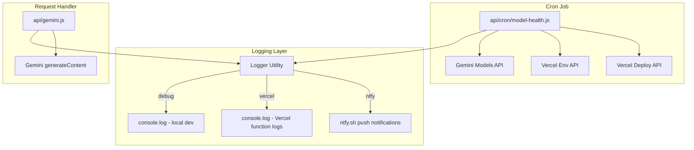
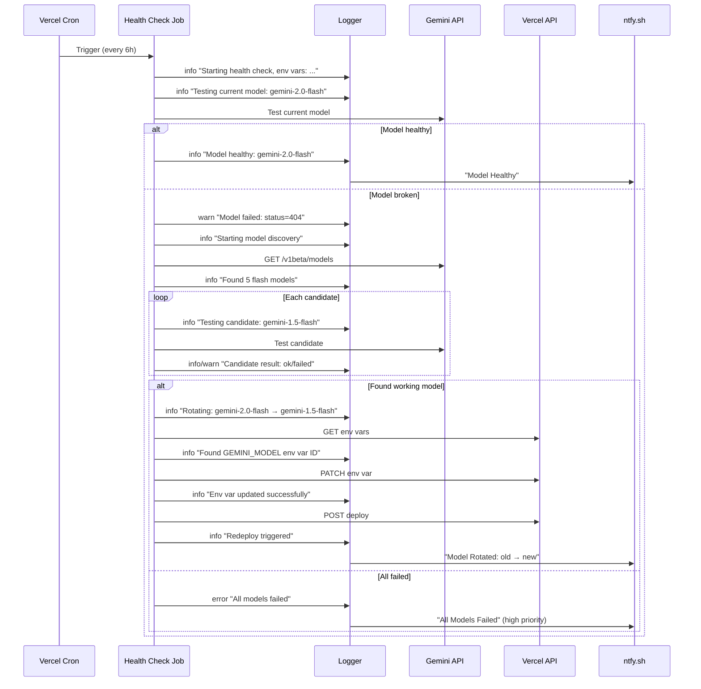

# Design Document: Gemini Model Health Check

## Overview

A self-healing model management system for a tarot app's Gemini API integration. The system has three parts:

1. **Unified Logger** — A logging utility that routes structured messages to console (local dev), Vercel function logs (production), and ntfy.sh (push alerts). Controlled by env vars. Every operation logs — success and failure alike.
2. **Cron Health Check** — A scheduled serverless function that validates the current model, discovers replacements, updates the Vercel env var, and triggers a redeploy. Every step logs before and after execution.
3. **Request Handler Observability** — Structured breadcrumb logging added to the existing `api/gemini.js` so that every invocation produces a complete trace in Vercel logs.

Design priority: zero silent failures. If something happens, you see it.

## Architecture





## Components and Interfaces

### 1. Logger Utility (`api/lib/logger.js`)

A shared logging utility used by both the cron job and the request handler. Designed for 2am debugging — every log includes timestamp, context, and structured data so you can grep and filter.

```javascript
export class Logger {
  constructor(context, options = {})
  info(message, data = {})
  warn(message, data = {})
  error(message, data = {})
  time(label)          // returns a function that, when called, returns elapsed ms
}
```

**Constructor parameters:**
- `context` — String label for the log source (e.g., "HealthCheck", "Gemini")
- `options.topic` — ntfy topic (defaults to `process.env.NTFY_TOPIC`)
- `options.destinations` — Override for `LOG_DESTINATIONS` env var

**Destination routing logic:**
```javascript
const envDests = process.env.LOG_DESTINATIONS
if (envDests) {
  destinations = envDests.split(',').map(d => d.trim())
} else {
  destinations = process.env.VERCEL ? ['vercel', 'ntfy'] : ['debug']
}
```

**Log format (console output — structured for grep/filter):**
```
[2024-01-15T10:30:00.123Z] [INFO] [HealthCheck] Model healthy | model=gemini-2.0-flash elapsed=1203ms
[2024-01-15T10:30:00.456Z] [WARN] [HealthCheck] Model failed | status=404 model=gemini-2.0-flash elapsed=2100ms body="model not found..."
[2024-01-15T10:30:01.789Z] [ERROR] [HealthCheck] Unhandled exception | error=TypeError: fetch failed stack=...
```

Key format decisions:
- ISO timestamp with milliseconds (for correlating with Vercel logs)
- Pipe separator between message and structured data (easy to split)
- Key=value pairs for structured data (grep-friendly)
- Body/error messages truncated to 200 chars (avoids log noise)

**Timing helper:**
```javascript
const elapsed = logger.time('gemini-api')
// ... do work ...
logger.info('API responded', { elapsed: elapsed() }) // elapsed() returns "1203ms"
```

**ntfy routing rules:**
- `info` → priority 3 (default), tags: `white_check_mark`
- `warn` → priority 4 (high), tags: `warning`
- `error` → priority 5 (max), tags: `rotating_light`
- ntfy body includes: message + structured data formatted as key=value pairs

### 2. Cron Entry Point (`api/cron/model-health.js`)

Single serverless function that orchestrates the health check flow.

**Exported handler:**
```javascript
export default async function handler(req, res)
```

**Config:**
```javascript
export const config = { maxDuration: 60 }
```

**Authorization:** Validates `Authorization: Bearer ${CRON_SECRET}`. Logs rejection and returns 401 if invalid.

**Execution flow (every step logs before AND after, with timing):**
1. `info` "Health check starting" + timestamp + all env var presence/absence
2. `info` "Checking authorization" → `info` "Auth valid" / `warn` "Auth rejected: {reason}"
3. `info` "Testing current model: {name}" → `info` "Model {name} responded in {ms}ms: {status}" / `warn` "Model {name} failed in {ms}ms: status={code} body={truncated_body}"
4. If healthy → `info` "Model healthy, no action needed" → notify → `info` "DONE: model healthy"
5. If broken → `warn` "Current model broken, starting discovery"
6. `info` "Fetching model list from Gemini API" → `info` "Models API responded in {ms}ms: {total_count} models" / `error` "Models API failed in {ms}ms: status={code} body={truncated}"
7. `info` "Filtered to {n} flash models: [{names}]"
8. For each candidate: `info` "Testing candidate {i}/{n}: {name}" → `info` "Candidate {name} responded in {ms}ms: ok" / `warn` "Candidate {name} failed in {ms}ms: status={code} body={truncated}"
9. If found → `info` "Replacement found: {name}. Starting rotation: {old} → {new}"
10. `info` "Fetching Vercel env vars" → `info` "Found GEMINI_MODEL env var (id={id})" / `error` "Vercel env list failed in {ms}ms: status={code} body={truncated}"
11. `info` "Updating GEMINI_MODEL: {old} → {new}" → `info` "Env var updated successfully in {ms}ms" / `error` "Env var update failed in {ms}ms: status={code} body={truncated}"
12. `info` "Triggering production redeploy" → `info` "Redeploy triggered: deployment_id={id} in {ms}ms" / `warn` "Redeploy failed in {ms}ms: {error} (rotation still considered successful)"
13. Notify "Model Rotated" → `info` "DONE: rotated {old} → {new}"
14. If all candidates failed → `error` "All {n} candidates failed" → notify → `error` "DONE: ALL MODELS FAILED"
15. If unhandled exception → `error` "UNHANDLED EXCEPTION: {name}: {message}\n{stack}" → notify → return 500

### 3. Internal Functions (within `api/cron/model-health.js`)

#### `testModel(logger, apiKey, modelName)`
- Logs: `info` "Testing model: {modelName}"
- POST to `https://generativelanguage.googleapis.com/v1beta/models/${modelName}:generateContent?key=${apiKey}`
- Body: `{ contents: [{ parts: [{ text: "Say hello" }] }] }`
- 10-second timeout via `AbortController`
- Logs result: `info` "Model {modelName} ok in {elapsed}ms" or `warn` "Model {modelName} failed in {elapsed}ms: status={code} body={first 200 chars}"
- Returns `{ ok: true, elapsed }` or `{ ok: false, status, message, elapsed }`

#### `discoverFlashModels(logger, apiKey)`
- Logs: `info` "Fetching model list from Gemini API"
- GET `https://generativelanguage.googleapis.com/v1beta/models?key=${apiKey}`
- Logs: `info` "Models API responded in {elapsed}ms: {total} total, {flash} flash+generateContent"
- On failure: `error` "Models API failed in {elapsed}ms: status={code} body={first 200 chars}"
- Filters: name includes "flash" AND `supportedGenerationMethods` includes "generateContent"
- Strips `models/` prefix
- Returns array sorted by name descending (newest versions first)

#### `updateVercelEnvVar(logger, token, projectId, varName, newValue)`
- Logs: `info` "Fetching env vars for project {projectId}"
- GET `https://api.vercel.com/v9/projects/${projectId}/env` with Bearer token
- Logs: `info` "Found env var {varName} (id={id}) in {elapsed}ms" or `error` "Env var {varName} not found in response ({n} vars checked)"
- PATCH `https://api.vercel.com/v9/projects/${projectId}/env/${envId}` with `{ value: newValue }`
- Logs: `info` "Updated {varName} to {newValue} in {elapsed}ms" or `error` "Update failed in {elapsed}ms: status={code} body={first 200 chars}"
- Returns `{ ok: true }` or `{ ok: false, message }`

#### `triggerRedeploy(logger, token, projectId)`
- Logs: `info` "Triggering production redeploy for {projectId}"
- POST `https://api.vercel.com/v13/deployments` with `{ name: projectId, target: "production" }`
- Logs: `info` "Redeploy triggered: id={deploymentId} in {elapsed}ms" or `warn` "Redeploy failed in {elapsed}ms: status={code} body={first 200 chars}"
- Returns `{ ok: true, id }` or `{ ok: false, message }`

### 4. Request Handler Logging Preamble (`api/gemini.js`)

Added to the very top of the handler function. Uses the shared Logger. The goal: if this function was invoked, you WILL see it in logs regardless of what happens next.

```javascript
const log = new Logger('Gemini')

// First thing: prove we're alive
log.info('Handler invoked', {
  method: req.method,
  url: req.url,
  GEMINI_API_KEY: apiKey ? 'present' : 'MISSING',
  GEMINI_MODEL: model || 'MISSING (using default)',
  NTFY_TOPIC: process.env.NTFY_TOPIC ? 'present' : 'MISSING'
})

// Fatal: missing API key — log AND alert before returning
if (!apiKey) {
  log.error('FATAL: GEMINI_API_KEY is missing, cannot proceed')
  return res.status(500).json({ error: 'Gemini API key not configured' })
}

// Method check
if (req.method !== 'POST') {
  log.warn('Wrong method', { method: req.method })
  return res.status(405).json({ error: 'Method not allowed' })
}
```

**Breadcrumbs throughout the handler (with timing where relevant):**
- `log.info('Processing request', { model, spreadType, cardCount: cards.length })`
- `log.info('Trying model', { model: tryModel, attempt: i+1, total: MODEL_FALLBACKS.length })`
- `log.info('Model succeeded', { model: usedModel, elapsed: ms, responseLen: text.length })`
- `log.warn('Model failed, trying fallback', { failed: tryModel, status: code, next: nextModel, attempt: i+1 })`
- `log.error('All models exhausted', { tried: MODEL_FALLBACKS, lastError: msg })`
- `log.error('Request failed', { status, message: msg, model, elapsed: ms })`
- `log.info('Response sent', { status: 200, model: usedModel })` (final line before return)

### 5. Vercel Cron Configuration (`vercel.json`)

Add `crons` array to existing config:
```json
{
  "crons": [
    {
      "path": "/api/cron/model-health",
      "schedule": "0 */6 * * *"
    }
  ]
}
```

### 6. Fallback Chain (in `api/gemini.js`)

```javascript
const MODEL_FALLBACKS = [
  process.env.GEMINI_MODEL || 'gemini-2.0-flash',
  'gemini-2.0-flash',
  'gemini-1.5-flash',
  'gemini-1.5-flash-8b'
]
```

Only 404/503 errors trigger fallback. Other errors throw immediately.

## Data Models

### Environment Variables

| Variable | Used By | Required | Description |
|----------|---------|----------|-------------|
| `GEMINI_API_KEY` | Both | Yes | Google AI Studio API key |
| `GEMINI_MODEL` | Both | Yes | Currently configured model name |
| `VERCEL_API_TOKEN` | Cron only | Yes | Vercel personal access token |
| `VERCEL_PROJECT_ID` | Cron only | Yes | Vercel project ID |
| `NTFY_TOPIC` | Both | Yes | ntfy.sh topic for notifications |
| `CRON_SECRET` | Cron only | Yes | Secret for cron auth header |
| `LOG_DESTINATIONS` | Both | No | Comma-separated: "debug", "vercel", "ntfy". Defaults to "vercel,ntfy" on Vercel, "debug" locally |
| `VERCEL` | Both | No | Auto-set by Vercel runtime. Used to detect production environment |

### Gemini Models API Response

```javascript
{
  models: [
    {
      name: "models/gemini-2.0-flash",
      displayName: "Gemini 2.0 Flash",
      supportedGenerationMethods: ["generateContent", "countTokens"]
    }
  ]
}
```

### Vercel Env API Response

```javascript
{
  envs: [
    {
      id: "env_abc123",
      key: "GEMINI_MODEL",
      value: "gemini-2.0-flash",
      target: ["production", "preview", "development"],
      type: "encrypted"
    }
  ]
}
```

### Internal Result Types

```javascript
// testModel
{ ok: true } | { ok: false, status: number, message: string }

// discoverFlashModels
string[] // e.g. ["gemini-2.0-flash", "gemini-1.5-flash"]
// throws on network failure

// updateVercelEnvVar
{ ok: true } | { ok: false, message: string }

// triggerRedeploy
{ ok: true, id: string } | { ok: false, message: string }
```


## Correctness Properties

*A property is a characteristic or behavior that should hold true across all valid executions of a system — essentially, a formal statement about what the system should do. Properties serve as the bridge between human-readable specifications and machine-verifiable correctness guarantees.*

### Property 1: Logger destination routing correctness

*For any* log message and any combination of `LOG_DESTINATIONS` values, the Logger SHALL write to exactly the destinations specified and no others. When `LOG_DESTINATIONS` is unset, it SHALL default to `["vercel", "ntfy"]` when `VERCEL` env var is present, and `["debug"]` otherwise.

**Validates: Requirements 1.2, 1.3**

### Property 2: Logger ntfy severity mapping

*For any* log message, when the "ntfy" destination is active, info-level messages SHALL be sent with priority 3, warn-level messages with priority 4, and error-level messages with priority 5.

**Validates: Requirements 1.6, 1.7**

### Property 3: Invalid authorization always returns 401

*For any* request to the Health_Check_Job that does not contain an `Authorization` header with the value `Bearer ${CRON_SECRET}` (including missing headers, wrong values, empty strings, malformed formats), the response status SHALL be 401.

**Validates: Requirements 2.4**

### Property 4: Successful model test prevents rotation

*For any* execution where `testModel` returns `{ ok: true }` for the Current_Model, the function SHALL NOT call `discoverFlashModels`, `updateVercelEnvVar`, or `triggerRedeploy`.

**Validates: Requirements 3.2**

### Property 5: HTTP errors trigger model discovery

*For any* HTTP status code in the 4xx or 5xx range returned by the Current_Model test, the function SHALL proceed to call `discoverFlashModels`.

**Validates: Requirements 3.3**

### Property 6: Flash model filter correctness

*For any* list of models returned by the Gemini Models API, `discoverFlashModels` SHALL return only models whose name contains "flash" AND whose `supportedGenerationMethods` array includes "generateContent". No other models SHALL appear in the output.

**Validates: Requirements 4.2**

### Property 7: First successful candidate wins

*For any* ordered list of flash model candidates where model at index N is the first to pass the Test_Prompt, the function SHALL select model N as the replacement and SHALL NOT test models at indices greater than N.

**Validates: Requirements 4.3, 4.4**

### Property 8: All notifications use configured topic

*For any* notification sent by the Logger to ntfy, the destination URL SHALL contain the value of the `NTFY_TOPIC` environment variable as the topic path segment.

**Validates: Requirements 7.5**

### Property 9: Unhandled exceptions always produce log + notification

*For any* exception thrown during the Health_Check_Job execution that is not caught by inner try/catch blocks, the outer error handler SHALL both log the exception (to all active destinations) and send a notification containing the error message.

**Validates: Requirements 8.1**

### Property 10: Env var presence logging accuracy

*For any* combination of present/absent environment variables (`GEMINI_API_KEY`, `GEMINI_MODEL`, `NTFY_TOPIC`), the startup log output SHALL correctly report "present" for variables that have a truthy value and "MISSING" for variables that are undefined or empty.

**Validates: Requirements 9.1**

### Property 11: Fallback chain triggers only on 404/503

*For any* error returned by a model in the fallback chain, the Request_Handler SHALL attempt the next fallback model only if the error status is 404 or 503. For all other error status codes, the handler SHALL throw immediately without trying further fallbacks.

**Validates: Requirements 10.3**

### Property 12: Every operation produces a log entry

*For any* execution path through the Health_Check_Job (success or failure at any step), there SHALL be at least one log entry for each step attempted. No step SHALL execute without a preceding or accompanying log call.

**Validates: Requirements 2.3, 3.1, 3.2, 3.3, 3.4, 4.1, 4.2, 4.3, 4.5, 5.1, 5.2, 5.3, 5.4, 5.5, 6.1, 6.2, 6.3**

## Error Handling

### Logger Error Strategy

| Error Scenario | Handling |
|---|---|
| ntfy.sh request fails | Write to console only, never throw |
| Invalid destination in LOG_DESTINATIONS | Ignore invalid entries, use remaining valid ones |
| Missing NTFY_TOPIC when ntfy active | Skip ntfy destination, log warning to console |

### Health Check Job Error Strategy

| Error Scenario | Log Level | Ntfy Priority | Behavior |
|---|---|---|---|
| Missing required env vars at startup | error | 5 (max) | Log all missing vars, terminate with 500 |
| Auth header invalid/missing | warn | — (no ntfy) | Log rejection, return 401 |
| Current model test timeout (10s) | warn | — | Log timeout, proceed to discovery |
| Current model HTTP error | warn | — | Log error details, proceed to discovery |
| Gemini Models API failure | error | 5 | Log + notify, terminate |
| All flash models fail test | error | 5 | Log + notify, terminate |
| Vercel env list API failure | error | 5 | Log + notify, terminate |
| Vercel env update API failure | error | 5 | Log + notify, terminate |
| Redeploy API failure | warn | 4 | Log + notify, continue (rotation still succeeded) |
| Unhandled exception | error | 5 | Outer try/catch logs + notifies |

### Request Handler Error Strategy

| Error Scenario | Log Level | Ntfy Priority | Behavior |
|---|---|---|---|
| GEMINI_API_KEY missing | error | 5 | Log + alert, return 500 |
| GEMINI_MODEL missing | info | — | Log, use default fallback |
| Primary model 404/503 | warn | — | Log, try fallback chain |
| Primary model other error | error | 4 | Log + notify, throw |
| All fallback models fail | error | 5 | Log + notify, return error |
| Successful response | info | 3 | Log model used + response length |

### Timeout Strategy

- Model test in cron job: 10 seconds per model (AbortController)
- Maximum 5 candidates tested (avoids exceeding 60s total)
- Model test in request handler: 50 seconds total (existing behavior)
- Cron job total: 60 seconds (Vercel function config)

## Testing Strategy

### Testing Approach

Testing focuses on:
1. **Unit tests** for pure logic (Logger routing, model filtering, result formatting)
2. **Property-based tests** for universal behaviors (destination routing, filter correctness, auth rejection, fallback logic)
3. **Integration tests** using mocked `fetch` for end-to-end cron job flows

### Test Framework

- **Unit/Integration**: Vitest (already available via Vite)
- **Property-based testing**: `fast-check` library with Vitest
- **Mocking**: Vitest `vi.fn()` and `vi.stubGlobal` for fetch + console

### Property-Based Test Configuration

- Minimum 100 iterations per property test
- Each test tagged: `Feature: gemini-model-health-check, Property N: {title}`
- fast-check arbitraries for:
  - Random destination combinations (subsets of ["debug", "vercel", "ntfy"])
  - Random model lists (names with/without "flash", various method arrays)
  - Random HTTP status codes (100-599)
  - Random authorization header strings
  - Random environment variable presence/absence combinations

### Unit Test Coverage

Unit tests for specific examples and edge cases:
- Logger falls back to console when ntfy fails (Req 1.8)
- Cron config in vercel.json is correct (Req 2.2)
- Timeout triggers discovery (Req 3.4 edge case)
- Models API failure sends notification (Req 4.6)
- Vercel API interaction sequence (Req 5.1-5.5)
- Redeploy failure still considers rotation successful (Req 6.3)
- Missing API key alert flow (Req 9.2 edge case)
- Fallback chain exhaustion (Req 10.5)

### Test File Structure

```
tests/
  unit/
    logger.test.js              # Logger routing + ntfy severity property tests
    modelHealthCheck.test.js    # Cron job logic unit + property tests
    geminiHandler.test.js       # Request handler logging + fallback property tests
```
