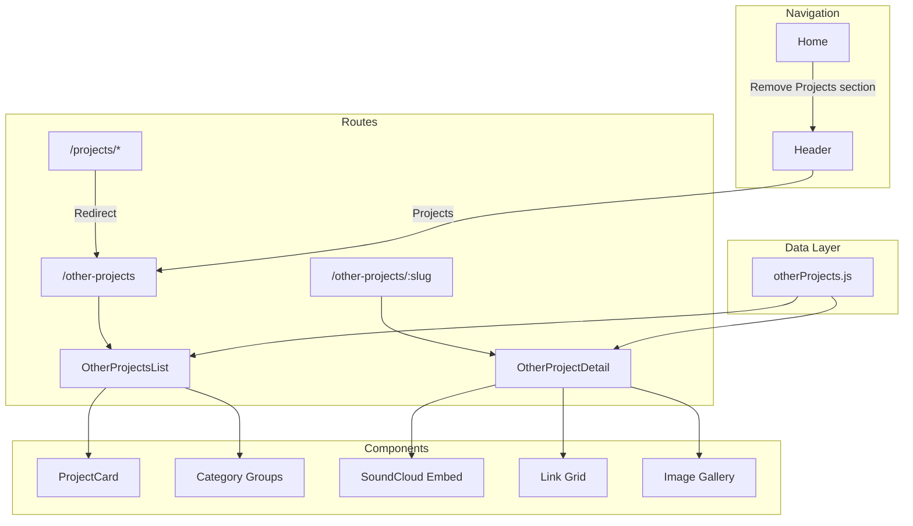

# Design Document: Projects Page

## Overview

This design transforms the existing "Projects" section into a dedicated "Projects" page that follows the architectural pattern established by the Blog feature. The implementation reuses the existing component structure while adding category support and expanded media capabilities for showcasing creative work beyond professional software development.

The key architectural decision is to model this feature after BlogList/BlogPost rather than creating a new pattern, ensuring consistency across the codebase and leveraging proven patterns for list-to-detail navigation.

## Architecture



## Components and Interfaces

### OtherProjectsList Component

A standalone page component that displays all creative projects organized by category. Follows the BlogList pattern with framer-motion animations.

```jsx
// src/components/OtherProjects/OtherProjectsList.jsx
interface OtherProjectsListProps {
  // No props - data loaded from otherProjects.js
}

// Internal state
const groupedProjects: Record<string, Project[]>  // Projects grouped by category
```

**Behavior:**
- Renders as a full page (not embedded in Home scroll)
- Groups projects by category with visual section headers
- Each project displays as a card with image, title, subtitle
- Cards link to `/other-projects/:slug`
- Uses staggerChildren and fadeIn animations matching Blog pattern

### OtherProjectDetail Component

A detail page component for individual projects with support for various media types.

```jsx
// src/components/OtherProjects/OtherProjectDetail.jsx
interface OtherProjectDetailProps {
  // No props - slug from useParams()
}
```

**Behavior:**
- Fetches project by slug from otherProjects data
- Renders title, subtitle, description
- Conditionally renders SoundCloud embed if `soundcloudUrl` exists
- Conditionally renders image gallery if `gallery` array exists
- Conditionally renders external links grid if `links` array exists
- Shows "Project not found" with back link for invalid slugs
- Back link navigates to `/other-projects` (not home)

### ProjectCard Component (Refactored)

Extracted reusable card component with fallback handling.

```jsx
// src/components/OtherProjects/ProjectCard.jsx
interface ProjectCardProps {
  project: Project
}
```

**Behavior:**
- Displays project image with fallback to colored card on error
- Fallback shows title and subtitle on colored background
- Maintains existing hover effects and styling

## Data Models

### Project Data Structure

```typescript
// src/utils/otherProjects.js
interface Project {
  slug: string              // URL-safe identifier (required)
  title: string             // Display title (required)
  subtitle: string          // Short description (required)
  description: string       // Full description for detail page (required)
  category: ProjectCategory // Category for grouping (required)
  bg: string                // Background color for fallback card (required)
  imgSrc?: string           // Image path (optional)
  soundcloudUrl?: string    // SoundCloud track/playlist URL (optional)
  links?: ExternalLink[]    // External platform links (optional)
  gallery?: string[]        // Array of image paths (optional)
}

interface ExternalLink {
  label: string  // Display text (e.g., "Spotify")
  url: string    // Full URL
}

type ProjectCategory = 'Music' | 'Art' | 'Photography' | 'Writing' | 'Other'
```

### Category Display Order

Categories render in a fixed order for consistent UX:
1. Music
2. Art
3. Photography
4. Writing
5. Other

Empty categories are not displayed.

### Migration from Existing Data

The existing `projects` array in `data.js` will be migrated to `otherProjects.js` with the addition of the `category` field. The existing Music project already has most required fields.

## Correctness Properties

*A property is a characteristic or behavior that should hold true across all valid executions of a system—essentially, a formal statement about what the system should do. Properties serve as the bridge between human-readable specifications and machine-verifiable correctness guarantees.*


### Property 1: Project Card Navigation

*For any* project in the otherProjects data, clicking its card in OtherProjectsList should navigate the user to `/other-projects/{project.slug}` and render that project's detail page.

**Validates: Requirements 2.4, 5.2**

### Property 2: Category Grouping

*For any* set of projects with category fields, the OtherProjectsList component should render them grouped by category, such that all projects of the same category appear together under a shared category heading.

**Validates: Requirements 3.1, 3.2, 3.3**

### Property 3: Conditional Media Rendering

*For any* project with optional media fields (soundcloudUrl, links, gallery), the OtherProjectDetail component should render the corresponding media element for each present field and omit elements for absent fields.

**Validates: Requirements 4.2, 4.3, 4.4**

### Property 4: Project Data Validity

*For any* object with required fields (slug, title, subtitle, description, category, bg), it should be accepted as a valid Project and rendered correctly in both list and detail views.

**Validates: Requirements 4.1**

## Error Handling

### Invalid Route Handling

When a user navigates to `/other-projects/:slug` with a slug that doesn't match any project:
- Display "Project not found" message
- Provide a back link to `/other-projects`
- Do not throw errors or crash the application

### Image Loading Failures

When a project's `imgSrc` fails to load:
- Display fallback card with project's `bg` color
- Show title and subtitle on the fallback card
- Maintain consistent card dimensions

### Missing Optional Fields

Components gracefully handle missing optional fields:
- No SoundCloud embed when `soundcloudUrl` is undefined
- No links section when `links` is undefined or empty
- No gallery section when `gallery` is undefined or empty

### Backward Compatibility

The `/projects` route redirects to `/other-projects` to prevent broken bookmarks or links.

## Testing Strategy

### Unit Tests

Focus on specific examples and edge cases:

1. **Route Configuration Tests**
   - Verify `/other-projects` renders OtherProjectsList
   - Verify `/other-projects/:slug` renders OtherProjectDetail
   - Verify `/projects` redirects to `/other-projects`

2. **Component Rendering Tests**
   - OtherProjectsList renders heading, subheading, and project cards
   - OtherProjectDetail shows "not found" for invalid slugs
   - ProjectCard displays fallback when image fails

3. **Navigation Tests**
   - Header shows "Projects" label
   - "Already here" message displays when clicking nav while on page
   - Home page does not include Projects section

### Property-Based Tests

Use a property-based testing library (e.g., fast-check with React Testing Library) with minimum 100 iterations per property test.

**Property 1 Test**: Generate random valid projects, render OtherProjectsList, simulate click on each card, verify navigation to correct URL.
- Tag: **Feature: other-projects-page, Property 1: Project Card Navigation**

**Property 2 Test**: Generate random sets of projects with various categories, render OtherProjectsList, verify projects are grouped by category.
- Tag: **Feature: other-projects-page, Property 2: Category Grouping**

**Property 3 Test**: Generate projects with random combinations of optional media fields, render OtherProjectDetail, verify only present fields render their corresponding elements.
- Tag: **Feature: other-projects-page, Property 3: Conditional Media Rendering**

**Property 4 Test**: Generate objects with required fields plus random optional fields, verify they pass validation and render without errors.
- Tag: **Feature: other-projects-page, Property 4: Project Data Validity**

### Test Configuration

- Property tests should run with minimum 100 iterations
- Use React Testing Library for component tests
- Use MemoryRouter for route testing
- Mock framer-motion to avoid animation timing issues in tests
