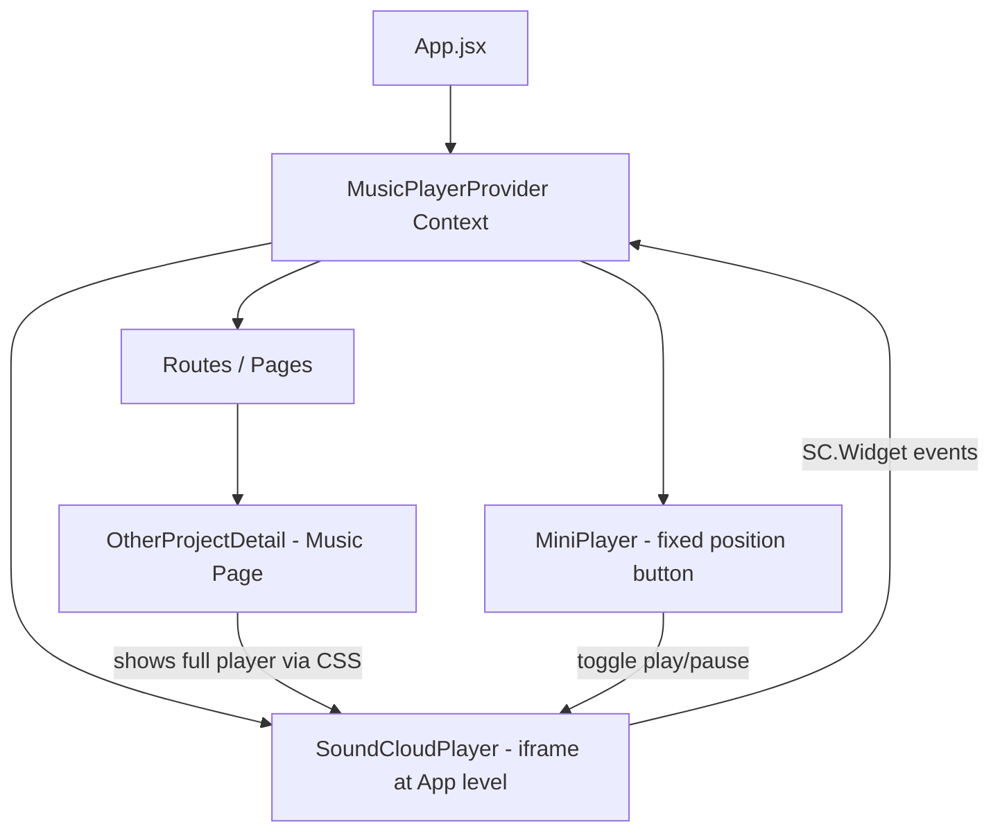

# Design Document: Persistent Music Player

## Overview

This design lifts the SoundCloud iframe player from `OtherProjectDetail.jsx` to `App.jsx` so it remains mounted across route changes. A React context manages playback state, the SoundCloud Widget API provides play/pause control and event detection, and a mini-player button with animated equalizer bars gives users persistent playback control from any page.

## Architecture



The architecture centers on three additions at the App level:

1. **MusicPlayerProvider** - React context providing `isPlaying`, `hasStarted`, and `toggle()` to the entire tree
2. **SoundCloudPlayer** - The iframe component, always mounted, positioned conditionally based on the current route
3. **MiniPlayer** - Fixed-position button rendered outside Routes, consuming context to show/hide and animate

## Components and Interfaces

### MusicPlayerContext

```jsx
// src/context/MusicPlayerContext.jsx
const MusicPlayerContext = createContext({
  isPlaying: false,
  hasStarted: false,
  toggle: () => {},
  iframeRef: null,
})
```

**State:**
- `isPlaying` (boolean) - whether audio is currently playing
- `hasStarted` (boolean) - whether audio has been played at least once this session

**Methods:**
- `toggle()` - calls `widget.toggle()` on the SoundCloud Widget API

**Refs:**
- `iframeRef` - ref to the iframe DOM element for SC.Widget initialization

### MusicPlayerProvider

Wraps the app in `App.jsx`. Initializes the SoundCloud Widget API, subscribes to `PLAY`, `PAUSE`, and `FINISH` events, and updates state accordingly.

### SoundCloudPlayer

```jsx
// src/components/MusicPlayer/SoundCloudPlayer.jsx
const SoundCloudPlayer = ({ isOnMusicPage })
```

**Props:**
- `isOnMusicPage` (boolean) - controls whether the iframe renders at full size in-page or is visually hidden

**Behavior:**
- Always mounted in the DOM
- When `isOnMusicPage` is true: renders at full width, 300px height, with the existing `.player` styling
- When `isOnMusicPage` is false: rendered with `position: absolute; width: 1px; height: 1px; clip: rect(0,0,0,0); overflow: hidden` to keep it active but invisible and non-interactive

### MiniPlayer

```jsx
// src/components/MusicPlayer/MiniPlayer.jsx
const MiniPlayer = ()
```

**Behavior:**
- Consumes `MusicPlayerContext`
- Renders only when `hasStarted` is true
- Fixed position, bottom-right corner (e.g. `bottom: 24px; right: 24px`)
- Circular button (~50px diameter)
- Contains 3-4 `<span>` elements styled as equalizer bars
- Bars animate when `isPlaying` is true, freeze when paused
- `onClick` calls `toggle()`
- Uses `framer-motion` for entrance/exit animation (fade + scale)

### Integration in OtherProjectDetail

The existing `{project.soundcloudUrl && ...}` block in `OtherProjectDetail.jsx` is replaced with a placeholder that uses the current route to signal the `SoundCloudPlayer` to render in full-size mode. The iframe itself is no longer rendered here.

## Data Models

### Context State Shape

```typescript
interface MusicPlayerState {
  isPlaying: boolean
  hasStarted: boolean
  toggle: () => void
  iframeRef: React.RefObject<HTMLIFrameElement>
}
```

### SoundCloud Widget Events Used

| Event | Action |
|-------|--------|
| `SC.Widget.Events.PLAY` | Set `isPlaying = true`, `hasStarted = true` |
| `SC.Widget.Events.PAUSE` | Set `isPlaying = false` |
| `SC.Widget.Events.FINISH` | Set `isPlaying = false` |

No persistent data models are needed. All state is session-scoped and ephemeral.


## Correctness Properties

*A property is a characteristic or behavior that should hold true across all valid executions of a system—essentially, a formal statement about what the system should do. Properties serve as the bridge between human-readable specifications and machine-verifiable correctness guarantees.*

### Property 1: Iframe persistence across routes

*For any* sequence of route navigations, the number of SoundCloud iframe elements in the DOM should always remain exactly one.

**Validates: Requirements 1.1**

### Property 2: Hidden player CSS correctness

*For any* route that is not the Music Page, the player container should have CSS properties that hide it without using `display:none` (specifically: clipped to zero size, no pointer events, no contribution to page layout).

**Validates: Requirements 1.3, 6.2, 6.3**

### Property 3: Mini-player visibility reflects hasStarted

*For any* combination of `hasStarted` and `isPlaying` state values, the Mini Player is rendered if and only if `hasStarted` is true.

**Validates: Requirements 2.1, 2.2, 2.3**

### Property 4: Equalizer animation reflects isPlaying

*For any* rendered Mini Player state, the equalizer bars have their animation CSS class active if and only if `isPlaying` is true.

**Validates: Requirements 3.1, 3.2**

### Property 5: Toggle inverts play state

*For any* state where `hasStarted` is true, invoking the `toggle()` function should result in `isPlaying` being the logical negation of its previous value.

**Validates: Requirements 4.1, 4.2, 4.3**

### Property 6: SoundCloud URL construction

*For any* valid `soundcloudUrl` string, the iframe `src` attribute should equal the template `https://w.soundcloud.com/player/?url=${encodeURIComponent(soundcloudUrl)}&color=%236D4B8A&auto_play=false&hide_related=true&show_comments=false&show_user=true&show_reposts=false&show_teaser=false&visual=true`.

**Validates: Requirements 5.3**

## Error Handling

| Scenario | Handling |
|----------|----------|
| SoundCloud Widget API fails to load (network issue) | Player renders as normal iframe; mini-player remains hidden since no play events fire. No crash. |
| `SC.Widget` is undefined at runtime | Guard the widget initialization with a check for `window.SC`. If unavailable, skip event binding. Player still functions as a basic embedded iframe. |
| User clicks mini-player before widget is ready | `toggle()` silently no-ops if widget ref is null. |
| Iframe `src` has invalid soundcloudUrl | The iframe renders a SoundCloud error page internally. No app-level error. |
| Multiple rapid toggle clicks | Debounce is not required since `widget.toggle()` is idempotent per call. State updates via widget events ensure consistency. |

## Testing Strategy

### Unit Tests

- Context provider initializes with `isPlaying: false`, `hasStarted: false`
- MiniPlayer does not render when `hasStarted` is false
- MiniPlayer renders when `hasStarted` is true
- Equalizer bars have correct count (3-4 spans)
- Player container has full-size styles on music page route
- Player container has hidden styles on non-music routes
- SoundCloud embed URL is correctly constructed from soundcloudUrl

### Property-Based Tests

Library: **fast-check** (JavaScript property-based testing library)

Each property test should run a minimum of 100 iterations.

- **Feature: persistent-music-player, Property 1: Iframe persistence across routes**
  Generate random sequences of route paths, simulate navigation, assert iframe count remains 1.

- **Feature: persistent-music-player, Property 2: Hidden player CSS correctness**
  Generate random non-music route paths, render the player, assert hidden CSS properties are applied and `display:none` is not used.

- **Feature: persistent-music-player, Property 3: Mini-player visibility reflects hasStarted**
  Generate random boolean pairs `(hasStarted, isPlaying)`, render MiniPlayer with that context, assert visibility equals `hasStarted`.

- **Feature: persistent-music-player, Property 4: Equalizer animation reflects isPlaying**
  Generate random `isPlaying` booleans (with `hasStarted = true`), render MiniPlayer, assert animation class presence equals `isPlaying`.

- **Feature: persistent-music-player, Property 5: Toggle inverts play state**
  Generate random `isPlaying` initial states (with `hasStarted = true`), call toggle, assert new state is negation of original.

- **Feature: persistent-music-player, Property 6: SoundCloud URL construction**
  Generate random URL strings, pass through the embed URL builder function, assert output matches the expected template with properly encoded URL.

### Integration Tests

- Navigate from music page to home while music is "playing" (mocked widget), verify mini-player appears and iframe remains
- Click mini-player toggle, verify context state flips
- Return to music page, verify full player displays correctly
