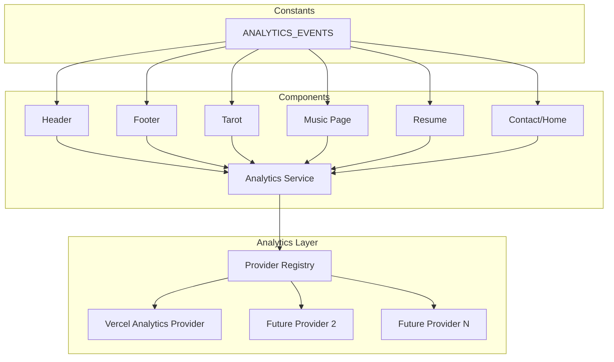

# Design Document: Portfolio Analytics

## Overview

This design adds lightweight analytics to the portfolio site using Vercel Analytics as the initial provider. The architecture follows a provider-agnostic pattern where a centralized `Analytics_Service` mediates between application components and analytics backends. Components never call vendor APIs directly — they import event constants and call `analytics.trackEvent(...)`. This keeps the codebase clean and allows additional providers to be added later by implementing a simple interface and registering it with the service.

Vercel Analytics handles automatic page view tracking out of the box for Vercel-deployed apps. Custom events are forwarded through the `Analytics_Service` to all registered providers. The entire system is designed to fail silently — analytics errors never bubble up to the user or break site functionality.

## Architecture



The architecture has three layers:

1. **Constants Layer** — Event name constants imported by components
2. **Service Layer** — The `Analytics_Service` singleton with `trackEvent()` and `registerProvider()`
3. **Provider Layer** — Individual provider adapters (starting with Vercel Analytics)

## Components and Interfaces

### Analytics Provider Interface

Each provider must implement this interface:

```javascript
/**
 * @typedef {Object} AnalyticsProvider
 * @property {string} name - Provider identifier
 * @property {(eventName: string, properties?: Record<string, string|number|boolean>) => void} trackEvent
 */
```

### Vercel Analytics Provider

```javascript
// src/utils/analytics/providers/vercelProvider.js
import { track } from '@vercel/analytics'

export const vercelProvider = {
  name: 'vercel',
  trackEvent(eventName, properties) {
    track(eventName, properties)
  }
}
```

### Analytics Service

```javascript
// src/utils/analytics/analyticsService.js

class AnalyticsService {
  constructor() {
    this.providers = []
  }

  registerProvider(provider) {
    this.providers.push(provider)
  }

  trackEvent(eventName, properties = {}) {
    for (const provider of this.providers) {
      try {
        provider.trackEvent(eventName, properties)
      } catch (error) {
        // Silently swallow — analytics must never break the site
      }
    }
  }
}

export const analytics = new AnalyticsService()
```

### Event Constants

```javascript
// src/utils/analytics/events.js

export const ANALYTICS_EVENTS = {
  // Portfolio
  PORTFOLIO_VIEWED: 'portfolio_viewed',
  RESUME_DOWNLOADED: 'resume_downloaded',
  GITHUB_LINK_CLICKED: 'github_link_clicked',
  LINKEDIN_LINK_CLICKED: 'linkedin_link_clicked',

  // Music
  MUSIC_PAGE_VIEWED: 'music_page_viewed',
  MUSIC_PLAY_CLICKED: 'music_play_clicked',
  MUSIC_PAUSE_CLICKED: 'music_pause_clicked',
  TRACK_CHANGED: 'track_changed',

  // Tarot
  TAROT_READING_STARTED: 'tarot_reading_started',
  TAROT_READING_GENERATED: 'tarot_reading_generated',
  FOLLOW_UP_QUESTION_ASKED: 'follow_up_question_asked',

  // Contact
  CONTACT_FORM_OPENED: 'contact_form_opened',
  CONTACT_FORM_SUBMITTED: 'contact_form_submitted',
}
```

### Initialization

```javascript
// src/utils/analytics/index.js
import { analytics } from './analyticsService'
import { vercelProvider } from './providers/vercelProvider'

// Register default providers
analytics.registerProvider(vercelProvider)

export { analytics }
export { ANALYTICS_EVENTS } from './events'
```

### Vercel Analytics Component (Page Views)

The `<Analytics />` component from `@vercel/analytics/react` is placed in `App.jsx` to enable automatic page view tracking. This handles Requirement 3 with zero component-level code.

```javascript
// In App.jsx
import { Analytics } from '@vercel/analytics/react'

const App = () => (
  <div className={`bg-primary ${css.container}`}>
    <Analytics />
    <Header />
    {/* ... routes ... */}
  </div>
)
```

## Data Models

### Event Properties

Custom events can carry optional key-value properties:

```javascript
/**
 * @typedef {Record<string, string|number|boolean>} EventProperties
 */
```

Vercel Analytics limits property values to strings, numbers, and booleans. The service passes properties as-is to providers — each provider is responsible for handling type constraints.

### Provider Registration

Providers are registered at app startup. The registry is a simple array held by the `AnalyticsService` singleton. No persistence or serialization is needed — providers are registered fresh on each page load.

### File Structure

```
src/utils/analytics/
├── index.js              # Public API — exports analytics instance and ANALYTICS_EVENTS
├── analyticsService.js   # AnalyticsService class
├── events.js             # ANALYTICS_EVENTS constants
└── providers/
    └── vercelProvider.js # Vercel Analytics provider adapter
```


## Correctness Properties

*A property is a characteristic or behavior that should hold true across all valid executions of a system — essentially, a formal statement about what the system should do. Properties serve as the bridge between human-readable specifications and machine-verifiable correctness guarantees.*

### Property 1: Event forwarding to all providers

*For any* set of N registered providers and any event (eventName, properties), calling `trackEvent(eventName, properties)` should invoke `trackEvent` on all N providers with the same eventName and properties.

**Validates: Requirements 2.2, 10.1**

### Property 2: Error resilience across providers

*For any* set of registered providers where one or more providers throw an error during `trackEvent`, the Analytics_Service should not propagate the error to the caller, and all non-throwing providers should still receive the event.

**Validates: Requirements 2.3, 8.1, 8.3**

### Property 3: Provider registration ordering

*For any* sequence of provider registrations and event firings, an event should only be forwarded to providers that were registered before that event was fired. A provider registered after an event is fired should not receive that prior event.

**Validates: Requirements 10.2**

## Error Handling

| Scenario | Behavior |
|----------|----------|
| Provider throws during `trackEvent` | Caught silently in try/catch; other providers still called |
| `@vercel/analytics` fails to load | `vercelProvider.trackEvent` will throw; caught by service |
| Invalid event properties passed | Passed through to providers as-is; provider handles internally |
| `trackEvent` called with no providers registered | No-op; loop over empty array |
| `registerProvider` called with invalid object | Provider added to array; will throw on next `trackEvent` call which is caught |

The error boundary principle: analytics code runs in try/catch at the service layer. No analytics failure path can reach the user or affect rendering.

## Testing Strategy

### Unit Tests (Vitest)

Unit tests cover specific integration examples:
- Verifying the `Analytics` component is rendered in App.jsx
- Verifying that specific component interactions call `trackEvent` with the correct event constant
- Verifying the ANALYTICS_EVENTS constants module exports all expected keys
- Verifying provider interface compliance

### Property-Based Tests (fast-check + Vitest)

Property tests use `fast-check` (already installed) to verify universal correctness:

- **Minimum 100 iterations** per property test
- Each test tagged with: `Feature: portfolio-analytics, Property N: {title}`
- Properties validate the Analytics_Service's core behaviors across all possible inputs

### Test Configuration

```javascript
// Example property test structure
import { fc } from 'fast-check'
import { describe, it, expect } from 'vitest'

describe('Analytics Service Properties', () => {
  // Feature: portfolio-analytics, Property 1: Event forwarding to all providers
  it('forwards events to all registered providers', () => {
    fc.assert(
      fc.property(
        fc.array(fc.string(), { minLength: 1, maxLength: 10 }), // provider names
        fc.string(), // event name
        fc.dictionary(fc.string(), fc.string()), // properties
        (providerNames, eventName, properties) => {
          // ... setup providers, call trackEvent, assert all received it
        }
      ),
      { numRuns: 100 }
    )
  })
})
```

### Test Coverage Strategy

| Layer | Testing Approach |
|-------|-----------------|
| Analytics Service (forwarding, error handling) | Property-based tests |
| Provider interface compliance | Unit tests |
| Component event integration | Unit tests with mocked analytics service |
| Event constants completeness | Unit tests |
| Page view tracking (Vercel built-in) | Manual verification post-deploy |
