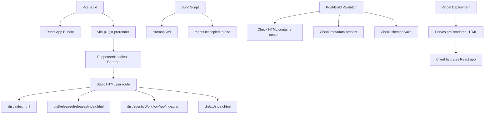

# Design Document: SEO & Crawlability Fix

## Overview

This design addresses the core technical SEO problem: aliawilkinson.com is a client-side rendered React SPA where crawlers see only an empty `<div id="root">`. The fix uses **vite-plugin-prerender** (formerly prerender-spa-plugin, rebuilt for Vite) to generate static HTML snapshots at build time for every route. This approach requires minimal architectural changes — no framework migration, no server-side rendering runtime — while delivering fully crawlable HTML for every page.

The solution adds:
1. Build-time pre-rendering via vite-plugin-prerender
2. Per-page SEO metadata via react-helmet-async
3. A build-time sitemap generator script
4. A robots.txt file
5. Semantic HTML improvements
6. A post-build validation script

## Architecture



### How It Works

1. **Build phase**: Vite compiles the React app as usual, then vite-plugin-prerender launches a headless browser, visits each defined route, waits for rendering, and saves the resulting HTML as static files.
2. **Serve phase**: Vercel serves the pre-rendered HTML files directly. When a crawler (or user) requests `/releaseofreleases`, Vercel returns `dist/releaseofreleases/index.html` with full content.
3. **Hydration**: Once the static HTML loads in a real browser, React hydrates and takes over for SPA navigation.

### Why vite-plugin-prerender

- Drop-in Vite plugin — no framework migration needed
- Works with existing react-router-dom setup
- Generates static HTML that Vercel serves directly
- No runtime server needed (pure static output)
- Battle-tested approach (successor to prerender-spa-plugin with 4K+ GitHub stars)

## Components and Interfaces

### 1. Pre-Renderer Configuration (vite.config.js)

Integrates vite-plugin-prerender into the Vite build pipeline.

```javascript
import prerender from 'vite-plugin-prerender'

// Added to vite.config.js plugins array
prerender({
  routes: ['/', '/about', '/releaseofreleases', '/iacPipelineValidation', 
           '/amplifyReactMigApp', '/cmdletCreationTemplate', 
           '/agenticWorkflowApp', '/cognitoIdentityArchitecture', 
           '/almModernization'],
  renderer: new PuppeteerRenderer({
    renderAfterTime: 3000, // wait for framer-motion animations
  })
})
```

### 2. SEO Metadata Manager (src/components/SEO/SEO.jsx)

A reusable component using react-helmet-async to inject per-page metadata.

```javascript
// Interface
const SEO = ({ title, description, url, image }) => {
  // Renders <Helmet> with:
  // - <title>{title}</title>
  // - <meta name="description" content={description} />
  // - <meta property="og:title" content={title} />
  // - <meta property="og:description" content={description} />
  // - <meta property="og:url" content={url} />
  // - <meta property="og:image" content={image} />
  // - <link rel="canonical" href={url} />
}
```

### 3. SEO Data Map (src/utils/seoData.js)

A data file mapping route slugs to their SEO metadata.

```javascript
// Interface
export const seoData = {
  home: { title, description, image },
  releaseofreleases: { title, description, image },
  // ... one entry per route
}
```

### 4. Sitemap Generator (scripts/generate-sitemap.js)

A Node.js script run during build that produces sitemap.xml.

```javascript
// Input: list of routes + base URL
// Output: dist/sitemap.xml following sitemap protocol
generateSitemap({
  baseUrl: 'https://aliawilkinson.com',
  routes: ['/', '/about', '/releaseofreleases', ...],
  outputPath: 'dist/sitemap.xml'
})
```

### 5. Validation Script (scripts/validate-seo.js)

A post-build script that reads the generated HTML files and checks for content presence.

```javascript
// For each route:
// 1. Read dist/{route}/index.html
// 2. Assert it contains text beyond <div id="root"></div>
// 3. Assert it contains <title> and <meta name="description">
// 4. Assert heading elements exist
// Also: validate sitemap.xml exists and contains expected URLs
```

### 6. robots.txt (public/robots.txt)

Static file served at site root.

```
User-agent: *
Allow: /

Sitemap: https://aliawilkinson.com/sitemap.xml
```

## Data Models

### SEO Metadata Entry

```typescript
interface SEOEntry {
  title: string          // Page title (50-60 chars ideal)
  description: string    // Meta description (150-160 chars ideal)
  url: string           // Absolute canonical URL
  image?: string        // OG image URL (optional, falls back to default)
}
```

### Route Configuration

```typescript
interface RouteConfig {
  path: string          // Route path (e.g., '/releaseofreleases')
  slug: string          // Identifier matching posts.js keys
  seo: SEOEntry         // Associated SEO metadata
}
```

### Sitemap Entry

```typescript
interface SitemapEntry {
  loc: string           // Absolute URL
  lastmod?: string      // ISO 8601 date (optional)
  changefreq?: string   // 'monthly' | 'weekly' etc. (optional)
  priority?: number     // 0.0 - 1.0 (optional)
}
```

### Validation Result

```typescript
interface ValidationResult {
  route: string         // Route path checked
  hasContent: boolean   // Contains text beyond empty div#root
  hasTitle: boolean     // Has <title> tag
  hasDescription: boolean // Has meta description
  hasHeadings: boolean  // Has h1/h2 elements
  errors: string[]      // List of specific failures
}
```


## Correctness Properties

*A property is a characteristic or behavior that should hold true across all valid executions of a system — essentially, a formal statement about what the system should do. Properties serve as the bridge between human-readable specifications and machine-verifiable correctness guarantees.*

### Property 1: Pre-rendered content completeness

*For any* defined route and its corresponding content in posts.js, the pre-rendered HTML file for that route shall contain the case study title text and paragraph content from the source data.

**Validates: Requirements 1.1, 1.2, 1.3, 2.2, 2.3, 6.3**

### Property 2: Route uniqueness

*For any* set of case studies defined in the data file, all route paths shall be unique (no two case studies share the same URL path).

**Validates: Requirements 2.1**

### Property 3: SEO metadata completeness

*For any* page with defined SEO data, the SEO component shall render output containing a title tag, meta description, all four Open Graph tags (og:title, og:description, og:url, og:image), and a canonical link tag with the correct absolute URL.

**Validates: Requirements 3.1, 3.2, 3.3, 3.4, 7.3**

### Property 4: Sitemap correctness

*For any* list of routes and a base URL, the sitemap generator shall produce valid XML following the sitemap protocol (urlset/url elements) where every route appears as an absolute URL prefixed with the base domain.

**Validates: Requirements 4.2, 4.3, 4.5**

### Property 5: Internal link discoverability

*For any* case study defined in the data file, the homepage rendered HTML shall contain an anchor element with an href attribute whose value matches that case study's URL path.

**Validates: Requirements 5.1, 5.2, 5.3**

### Property 6: Single h1 per page

*For any* page rendered by the application, the HTML output shall contain exactly one h1 element.

**Validates: Requirements 6.1**

### Property 7: Heading hierarchy

*For any* page rendered by the application, the heading elements shall follow proper hierarchical order — no heading level shall be skipped (e.g., h1 followed directly by h3 without an intervening h2).

**Validates: Requirements 6.2**

### Property 8: Validation script correctness

*For any* HTML string input, the validation function shall correctly report whether the input contains: (a) text content beyond an empty div#root, (b) heading elements, (c) a title tag, and (d) a meta description tag.

**Validates: Requirements 8.1, 8.2, 8.3, 8.4**

## Error Handling

| Scenario | Handling Strategy |
|----------|-------------------|
| Pre-render fails for a route | Log error with route path, continue processing remaining routes, exit with non-zero code if any route fails |
| SEO data missing for a page | Fall back to site-wide defaults (site title, generic description) |
| Sitemap generation fails | Build continues but validation script reports missing sitemap as error |
| Validation check fails | Report specific failure (route + check type) to stdout, exit with non-zero code |
| Headless browser timeout during pre-render | Retry once with extended timeout (10s), then log failure and continue |

## Testing Strategy

### Property-Based Testing

**Library**: [fast-check](https://github.com/dubzzz/fast-check) (JavaScript property-based testing)

Each correctness property will be implemented as a property-based test running a minimum of 100 iterations. Properties are tested by generating random valid inputs and verifying the property holds.

**Test Configuration**:
- Minimum 100 iterations per property test
- Each test tagged with: `Feature: seo-crawlability-fix, Property {N}: {title}`

**Property test targets**:
- Property 3 (SEO metadata): Generate random SEO data objects, render the SEO component, verify all tags present
- Property 4 (Sitemap): Generate random route lists, run the generator, validate XML structure and URL presence
- Property 7 (Heading hierarchy): Generate random heading sequences, run the hierarchy validator, verify correctness
- Property 8 (Validation script): Generate random HTML strings with/without required elements, verify detection accuracy

### Unit Testing

**Library**: Vitest (already compatible with the Vite setup)

Unit tests focus on specific examples and edge cases:
- SEO component renders correct defaults when no data provided
- Sitemap generator handles empty route list
- Sitemap generator handles routes with special characters
- Validation script correctly identifies an empty div#root-only page as failing
- Validation script correctly identifies a fully rendered page as passing
- robots.txt contains expected directives

### Integration Testing (Post-Build Validation)

The validation script (`scripts/validate-seo.js`) serves as the integration test layer:
- Run after `vite build` completes
- Check every pre-rendered HTML file in dist/
- Verify sitemap.xml existence and content
- Verify robots.txt accessibility
- Exit non-zero on any failure (suitable for CI)

### Test Organization

```
tests/
  unit/
    seo-component.test.js
    sitemap-generator.test.js
    validation-script.test.js
  property/
    seo-metadata.property.test.js
    sitemap-correctness.property.test.js
    heading-hierarchy.property.test.js
    validation-detection.property.test.js
```
