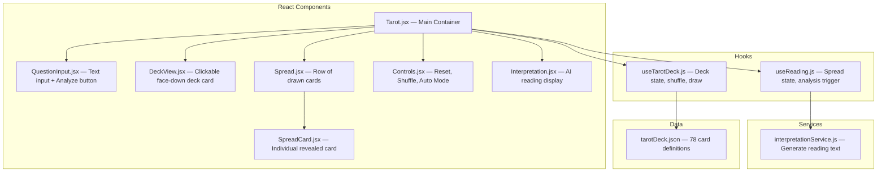

# Design Document: Tarot App

## Overview

This design describes a complete rewrite of the Tarot reading app within the existing React + Vite portfolio site. The new architecture centers around a deck-first interaction model: users click a face-down deck to draw cards one at a time, building a spread manually. An "Analyze" button triggers interpretation of drawn cards (or auto-draws 3 if none exist). Controls allow reset, shuffle, and auto-mode with preset card counts.

Key changes from the prior design:
- **No external API** — card data is loaded from local `src/data/tarotDeck.json`
- **Deck-centric interaction** — a single face-down card is the primary draw mechanism
- **Incremental spread building** — cards accumulate in a row, wrapping as needed
- **Interpretation engine** — generates reflection-oriented readings from card data
- **Auto Mode** — one-click draws of 1, 3, or 5 cards with automatic interpretation
- **Spread presets** — Single Card, Three Card (Past/Present/Future), Celtic Cross (10 cards)

## Architecture



### Component Hierarchy

```
Tarot (main container)
├── QuestionInput (text input + Analyze button)
├── DeckView (clickable face-down deck)
├── Spread (row of drawn/revealed cards)
│   └── SpreadCard (individual card with image + meaning)
├── Controls (Reset Deck, Shuffle Deck, Auto Mode buttons)
└── Interpretation (generated reading output)
```

## Components and Interfaces

### Tarot (Main Container)

Orchestrates all sub-components. Connects hooks and passes callbacks down.

```jsx
// Tarot.jsx
const Tarot = () => {
  const { remainingDeck, drawnCards, drawCard, shuffleDeck, resetDeck, drawMultiple } = useTarotDeck()
  const { question, setQuestion, interpretation, analyze, clearInterpretation } = useReading()

  const handleAnalyze = () => {
    if (drawnCards.length === 0) {
      // Auto-draw 3, then analyze
      const newCards = drawMultiple(3)
      analyze(newCards, question)
    } else {
      analyze(drawnCards, question)
    }
  }

  const handleReset = () => {
    resetDeck()
    clearInterpretation()
  }

  const handleAutoMode = (count) => {
    resetDeck()
    clearInterpretation()
    const newCards = drawMultiple(count)
    analyze(newCards, question)
  }

  // ...renders QuestionInput, DeckView, Spread, Controls, Interpretation
}
```

### QuestionInput

```jsx
// QuestionInput.jsx
/**
 * @typedef {Object} QuestionInputProps
 * @property {string} question - Current question text
 * @property {function} onQuestionChange - Updates question state
 * @property {function} onAnalyze - Triggers analysis
 */
const QuestionInput = ({ question, onQuestionChange, onAnalyze }) => {
  return (
    <div className={css.questionArea}>
      <input
        type="text"
        placeholder="What would you like to reflect on?"
        value={question}
        onChange={(e) => onQuestionChange(e.target.value)}
      />
      <button onClick={onAnalyze}>Analyze</button>
    </div>
  )
}
```

### DeckView

Displays a single full-size face-down card. Click draws a card.

```jsx
// DeckView.jsx
/**
 * @typedef {Object} DeckViewProps
 * @property {number} remainingCount - Cards left in deck
 * @property {function} onDraw - Callback to draw a card
 * @property {boolean} isEmpty - Whether deck has no cards left
 */
const DeckView = ({ remainingCount, onDraw, isEmpty }) => {
  return (
    <div className={css.deckArea}>
      <div
        className={`${css.deckCard} ${isEmpty ? css.deckEmpty : ''}`}
        onClick={!isEmpty ? onDraw : undefined}
      >
        <div className={css.deckCardInner}>
          <span>✦</span>
          {!isEmpty && <span className={css.deckCount}>{remainingCount}</span>}
          {isEmpty && <span className={css.deckEmptyLabel}>Empty</span>}
        </div>
      </div>
    </div>
  )
}
```

### Spread

Displays drawn cards in a wrapping row.

```jsx
// Spread.jsx
/**
 * @typedef {Object} SpreadProps
 * @property {Array<DrawnCard>} drawnCards - Cards currently in the spread
 * @property {Object} spreadPreset - Optional preset with position labels
 */
const Spread = ({ drawnCards, spreadPreset }) => {
  return (
    <div className={css.spread}>
      {drawnCards.map((drawn, index) => (
        <SpreadCard
          key={drawn.card.name_short}
          card={drawn.card}
          isReversed={drawn.isReversed}
          label={spreadPreset?.labels?.[index] || null}
        />
      ))}
    </div>
  )
}
```

### SpreadCard

An already-revealed card displayed in the spread.

```jsx
// SpreadCard.jsx
const SpreadCard = ({ card, isReversed, label }) => {
  const [imageError, setImageError] = useState(false)
  const imageUrl = getCardImageUrl(card.name_short)

  return (
    <motion.div
      className={css.spreadCard}
      initial={{ opacity: 0, scale: 0.8 }}
      animate={{ opacity: 1, scale: 1 }}
      transition={{ duration: 0.3 }}
    >
      {label && <span className={css.positionLabel}>{label}</span>}
      <div className={css.spreadCardImage}>
        {imageError ? (
          <FallbackCard name={card.name} />
        ) : (
           setImageError(true)}
          />
        )}
      </div>
      <div className={css.spreadCardInfo}>
        <span className={css.cardName}>
          {card.name}
          {isReversed && <span className={css.reversedBadge}>Reversed</span>}
        </span>
      </div>
    </motion.div>
  )
}
```

### Controls

```jsx
// Controls.jsx
/**
 * @typedef {Object} ControlsProps
 * @property {function} onReset - Reset deck callback
 * @property {function} onShuffle - Shuffle remaining cards callback
 * @property {function} onAutoMode - Auto mode callback (receives card count)
 * @property {boolean} isShuffling - Whether shuffle is in progress
 * @property {boolean} hasDrawnCards - Whether any cards are in the spread
 */
const Controls = ({ onReset, onShuffle, onAutoMode, isShuffling, hasDrawnCards }) => {
  return (
    <div className={css.controls}>
      <div className={css.actions}>
        <button onClick={onReset}>Reset Deck</button>
        <button onClick={onShuffle} disabled={isShuffling}>
          {isShuffling ? 'Shuffling...' : 'Shuffle Deck'}
        </button>
      </div>
      <div className={css.autoMode}>
        <span className={css.autoLabel}>Auto Mode:</span>
        <button onClick={() => onAutoMode(1)}>1 Card</button>
        <button onClick={() => onAutoMode(3)}>3 Cards</button>
        <button onClick={() => onAutoMode(5)}>5 Cards</button>
      </div>
    </div>
  )
}
```

### Interpretation

```jsx
// Interpretation.jsx
/**
 * @typedef {Object} InterpretationProps
 * @property {Object|null} reading - Generated interpretation object
 * @property {boolean} isGenerating - Whether interpretation is being generated
 */
const Interpretation = ({ reading, isGenerating }) => {
  if (!reading && !isGenerating) return null

  return (
    <div className={css.interpretation}>
      {isGenerating ? (
        <p className={css.generating}>Generating your reading...</p>
      ) : (
        <>
          <h3>Your Reading</h3>
          <p className={css.summary}>{reading.summary}</p>
          <h4>Reflection Points</h4>
          <ul>{reading.reflections.map((r, i) => <li key={i}>{r}</li>)}</ul>
          <h4>Card Connections</h4>
          <p>{reading.connections}</p>
        </>
      )}
    </div>
  )
}
```

## Data Models

### Card (from tarotDeck.json)

```typescript
interface Card {
  name: string          // "The Fool"
  name_short: string    // "ar00"
  type: "major" | "minor"
  suit: string | null   // null for Major Arcana; "wands" | "cups" | "swords" | "pentacles"
  desc: string          // Card imagery description
  meaning_up: string    // Upright interpretation
  meaning_rev: string   // Reversed interpretation
}
```

### DrawnCard

```typescript
interface DrawnCard {
  card: Card
  isReversed: boolean
}
```

### DeckState (managed by useTarotDeck)

```typescript
interface DeckState {
  fullDeck: Card[]           // All 78 cards (immutable reference)
  remainingDeck: DrawnCard[] // Shuffled cards not yet drawn
  drawnCards: DrawnCard[]    // Cards drawn into spread (in order)
  isShuffling: boolean
}
```

### InterpretationResult

```typescript
interface InterpretationResult {
  summary: string        // Overall reading narrative
  reflections: string[]  // Bullet-point reflection prompts
  connections: string    // Narrative connecting cards to each other
}
```

### Spread Presets

```typescript
interface SpreadPreset {
  name: string
  cardCount: number
  labels: string[]
}

const PRESETS = {
  single: { name: "Single Card", cardCount: 1, labels: ["Core Message"] },
  three: { name: "Three Card Spread", cardCount: 3, labels: ["Past", "Present", "Future"] },
  celtic: { name: "Celtic Cross", cardCount: 10, labels: [
    "Present", "Challenge", "Foundation", "Past", "Crown",
    "Future", "Self", "Environment", "Hopes/Fears", "Outcome"
  ]}
}
```

### useTarotDeck Hook (Revised)

```jsx
// hooks/useTarotDeck.js
import { useState, useCallback } from 'react'
import { tarotDeck } from '../data/tarotDeck'

const shuffleArray = (array) => {
  const shuffled = [...array]
  for (let i = shuffled.length - 1; i > 0; i--) {
    const j = Math.floor(Math.random() * (i + 1))
    ;[shuffled[i], shuffled[j]] = [shuffled[j], shuffled[i]]
  }
  return shuffled
}

const useTarotDeck = () => {
  const [remainingDeck, setRemainingDeck] = useState(() =>
    shuffleArray(tarotDeck).map(card => ({ card, isReversed: Math.random() < 0.5 }))
  )
  const [drawnCards, setDrawnCards] = useState([])
  const [isShuffling, setIsShuffling] = useState(false)

  // Draw one card from the top of remaining deck
  const drawCard = useCallback(() => {
    if (remainingDeck.length === 0) return null
    const [drawn, ...rest] = remainingDeck
    setRemainingDeck(rest)
    setDrawnCards(prev => [...prev, drawn])
    return drawn
  }, [remainingDeck])

  // Draw multiple cards at once
  const drawMultiple = useCallback((count) => {
    const toDraw = remainingDeck.slice(0, count)
    setRemainingDeck(prev => prev.slice(count))
    setDrawnCards(prev => [...prev, ...toDraw])
    return toDraw
  }, [remainingDeck])

  // Shuffle only remaining (undealt) cards
  const shuffleDeck = useCallback(() => {
    setIsShuffling(true)
    setTimeout(() => {
      setRemainingDeck(prev =>
        shuffleArray(prev.map(d => d.card)).map(card => ({
          card, isReversed: Math.random() < 0.5
        }))
      )
      setIsShuffling(false)
    }, 400)
  }, [])

  // Reset: return all cards, reshuffle full deck
  const resetDeck = useCallback(() => {
    setIsShuffling(true)
    setTimeout(() => {
      setRemainingDeck(
        shuffleArray(tarotDeck).map(card => ({ card, isReversed: Math.random() < 0.5 }))
      )
      setDrawnCards([])
      setIsShuffling(false)
    }, 400)
  }, [])

  return {
    remainingDeck,
    drawnCards,
    isShuffling,
    drawCard,
    drawMultiple,
    shuffleDeck,
    resetDeck,
    remainingCount: remainingDeck.length
  }
}

export default useTarotDeck
```

### useReading Hook (Revised)

```jsx
// hooks/useReading.js
import { useState, useCallback } from 'react'
import { generateInterpretation } from '../services/interpretationService'

const useReading = () => {
  const [question, setQuestion] = useState('')
  const [interpretation, setInterpretation] = useState(null)
  const [isGenerating, setIsGenerating] = useState(false)

  const analyze = useCallback((cards, questionText) => {
    setIsGenerating(true)
    const result = generateInterpretation(cards, questionText)
    setInterpretation(result)
    setIsGenerating(false)
  }, [])

  const clearInterpretation = useCallback(() => {
    setInterpretation(null)
  }, [])

  return {
    question,
    setQuestion,
    interpretation,
    isGenerating,
    analyze,
    clearInterpretation
  }
}

export default useReading
```

### Interpretation Service

```jsx
// services/interpretationService.js

/**
 * Generates a tarot reading interpretation from drawn cards.
 * Frames all output as self-reflection (not prediction).
 *
 * @param {DrawnCard[]} cards - Array of drawn cards with orientation
 * @param {string} question - Optional user question
 * @returns {InterpretationResult}
 */
export const generateInterpretation = (cards, question = '') => {
  const cardSummaries = cards.map((drawn, i) => {
    const meaning = drawn.isReversed ? drawn.card.meaning_rev : drawn.card.meaning_up
    return { name: drawn.card.name, meaning, isReversed: drawn.isReversed, position: i }
  })

  const summary = buildSummary(cardSummaries, question)
  const reflections = buildReflections(cardSummaries, question)
  const connections = buildConnections(cardSummaries)

  return { summary, reflections, connections }
}

// Internal helpers build narrative from card meanings
// Implementation will compose card meanings into cohesive text
```


## Correctness Properties

*A property is a characteristic or behavior that should hold true across all valid executions of a system—essentially, a formal statement about what the system should do. Properties serve as the bridge between human-readable specifications and machine-verifiable correctness guarantees.*

### Property 1: Deck Partition Invariant

*For any* sequence of draw operations from a full 78-card deck, the union of remaining cards and drawn cards SHALL always equal the original full deck (same cards, no duplicates, no missing cards).

**Validates: Requirements 3.7, 3.8**

### Property 2: Reset Restores Initial State

*For any* deck state (after arbitrary draws, shuffles, and interpretations), calling reset SHALL result in exactly 78 remaining cards, 0 drawn cards, and no interpretation displayed.

**Validates: Requirements 5.2, 5.3, 5.4, 5.5**

### Property 3: Shuffle Preserves Partition

*For any* deck state with N remaining cards and M drawn cards, calling shuffle SHALL result in N remaining cards containing the same card set (potentially reordered) and M drawn cards completely unchanged.

**Validates: Requirements 6.2, 6.3**

### Property 4: Orientation Distribution

*For any* shuffle operation producing N cards (where N > 50), the proportion of reversed cards SHALL fall within [0.30, 0.70] (approximately 50% with reasonable variance for random sampling).

**Validates: Requirements 10.1, 6.4**

### Property 5: Orientation Preservation

*For any* drawn card, its isReversed value SHALL remain constant across all operations (draw, shuffle, analyze) until a reset is performed.

**Validates: Requirements 10.3**

### Property 6: Analyze Preserves Existing Spread

*For any* non-empty spread of drawn cards, calling analyze SHALL not modify the drawn cards array (no cards added or removed).

**Validates: Requirements 4.2**

### Property 7: Interpretation Incorporates Question

*For any* non-empty question string and any set of drawn cards, the generated interpretation's summary SHALL contain or reference the provided question text.

**Validates: Requirements 4.3, 9.6**

### Property 8: Interpretation Uses Correct Card Meanings

*For any* set of drawn cards, the interpretation SHALL reference each card's name, and for each card use meaning_up when upright or meaning_rev when reversed.

**Validates: Requirements 4.4, 9.4**

### Property 9: Interpretation Completeness

*For any* valid set of drawn cards (1 or more), the generated interpretation SHALL contain a non-empty summary, at least one reflection point, and a non-empty connections section.

**Validates: Requirements 9.1, 9.2, 9.3**

### Property 10: Auto Mode Draws Exact Count

*For any* auto mode card count (1, 3, or 5) and a deck with sufficient remaining cards, auto mode SHALL draw exactly that number of cards into the spread.

**Validates: Requirements 7.2, 7.3**

### Property 11: Spread Preset Labels

*For any* spread preset with N positions and N drawn cards, each card at index i SHALL be assigned the label at preset.labels[i].

**Validates: Requirements 8.4**

### Property 12: Question Optionality

*For any* operation (draw, analyze, auto mode, reset, shuffle), the operation SHALL succeed regardless of whether the question input is empty or non-empty.

**Validates: Requirements 2.3**

## Error Handling

| Error Condition | Handling Strategy |
|----------------|-------------------|
| Draw from empty deck | Disable deck click, show "Empty" state on deck card |
| Image fails to load | Display FallbackCard component with card name and gradient |
| Auto mode with insufficient remaining cards | Draw as many as available, generate interpretation with available cards |
| Interpretation generation fails | Display error message with option to retry |
| Invalid card data in deck | Skip malformed entries during initialization; log warning |

### Image Loading Strategy

Cards use the pattern `https://sacred-texts.com/tarot/pkt/img/{name_short}.jpg`. Since external images may fail:
- Each SpreadCard handles its own `onError` with local state
- FallbackCard shows a gradient background with the card name
- No retry for images — fallback is the permanent state once error occurs

### Graceful Degradation

- If all images fail (e.g., sacred-texts.com down), the app remains fully functional with FallbackCards
- Interpretation service is synchronous and local — no network failures possible
- Card data is bundled locally — no loading state needed after initial render

## Testing Strategy

### Dual Testing Approach

- **Unit tests**: Verify specific examples (component rendering, preset definitions, edge cases)
- **Property tests**: Verify universal invariants across randomized inputs (deck operations, interpretation generation)

### Property-Based Testing Configuration

- **Library**: fast-check (already installed)
- **Test runner**: vitest (already configured)
- **Minimum iterations**: 100 per property test
- **Tag format**: `Feature: tarot-app, Property {number}: {property_text}`

### Unit Test Coverage

| Test Area | Test Cases |
|-----------|------------|
| DeckView | Renders face-down card; shows count; disables when empty |
| SpreadCard | Shows card image; applies reversed rotation; shows fallback on error |
| Controls | All buttons render; shuffle disables during operation |
| QuestionInput | Input accepts text; Analyze button fires callback |
| Interpretation | Renders all sections; shows loading state; hidden when null |
| Spread Presets | Single/Three/Celtic preset definitions correct |

### Property Test Plan

| Property | Test Strategy |
|----------|---------------|
| Property 1: Deck Partition | Generate random draw sequences; verify union = full deck |
| Property 2: Reset State | Generate random state mutations then reset; verify clean state |
| Property 3: Shuffle Partition | Draw random cards, shuffle; verify remaining set unchanged, drawn unchanged |
| Property 4: Orientation Distribution | Generate multiple shuffles; verify ~50% distribution |
| Property 5: Orientation Preservation | Draw cards, perform operations; verify isReversed unchanged |
| Property 6: Analyze Preserves Spread | Draw random cards, call analyze; verify drawn unchanged |
| Property 7: Question in Interpretation | Generate random questions + cards; verify question in output |
| Property 8: Correct Meanings | Generate cards with orientations; verify correct meaning used |
| Property 9: Interpretation Completeness | Generate random card sets; verify all sections non-empty |
| Property 10: Auto Mode Count | For each count (1,3,5); verify exact draw count |
| Property 11: Preset Labels | Generate card draws with presets; verify label assignment |
| Property 12: Question Optionality | Run all operations with/without question; verify success |

### Test File Structure

```
src/
├── hooks/
│   ├── useTarotDeck.test.js      (unit + property tests for deck logic)
│   └── useReading.test.js        (unit + property tests for reading state)
├── services/
│   └── interpretationService.test.js (property tests for interpretation)
└── components/Tarot/
    ├── Tarot.test.jsx             (integration tests)
    ├── SpreadCard.test.jsx        (unit tests)
    └── Controls.test.jsx          (unit tests)
```
