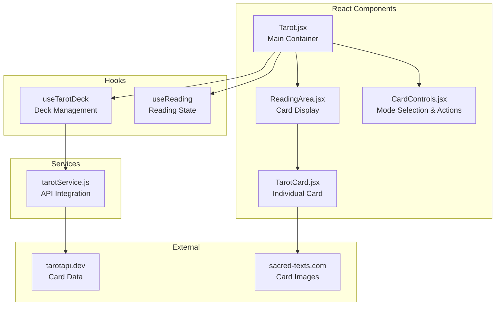

# Design Document: Tarot Reading App

## Overview

This design document describes the technical architecture for a Tarot reading app integrated into an existing React + Vite portfolio site. The app provides single card draws and three-card spreads with card flip animations, reversals support, and mobile responsiveness.

The implementation leverages the existing project infrastructure including framer-motion for animations, SCSS modules for styling, and the established component patterns. Card data is fetched from tarotapi.dev, with images sourced from sacred-texts.com's public domain Rider-Waite collection.

## Architecture



### Component Hierarchy

```
Tarot (main container)
├── CardControls (mode selection, shuffle, new reading)
└── ReadingArea (card display area)
    └── TarotCard (individual card with flip animation)
```

## Components and Interfaces

### TarotCard Component

The core card component handles display, flip animation, and fallback rendering.

```jsx
// TarotCard.jsx
import { useState } from 'react'
import { motion } from 'framer-motion'

/**
 * @typedef {Object} TarotCardProps
 * @property {Object} card - Card data from API
 * @property {string} card.name - Full card name
 * @property {string} card.name_short - Short name for image URL
 * @property {string} card.meaning_up - Upright meaning
 * @property {string} card.meaning_rev - Reversed meaning
 * @property {string} card.desc - Card description
 * @property {boolean} isReversed - Whether card is reversed
 * @property {boolean} isRevealed - Whether card face is showing
 * @property {string} [label] - Position label (Past/Present/Future)
 * @property {function} onReveal - Callback when card is clicked to reveal
 */

const TarotCard = ({ card, isReversed, isRevealed, label, onReveal }) => {
  const [imageError, setImageError] = useState(false)
  const [isFlipping, setIsFlipping] = useState(false)
  
  const imageUrl = `https://sacred-texts.com/tarot/pkt/img/${card.name_short}.jpg`
  
  const handleClick = () => {
    if (!isRevealed && !isFlipping) {
      setIsFlipping(true)
      onReveal()
    }
  }
  
  const handleFlipComplete = () => {
    setIsFlipping(false)
  }
  
  return (
    <div className={css.cardContainer}>
      {label && <span className={css.positionLabel}>{label}</span>}
      <motion.div
        className={css.card}
        onClick={handleClick}
        animate={{ rotateY: isRevealed ? 180 : 0 }}
        transition={{ duration: 0.6, ease: "easeInOut" }}
        onAnimationComplete={handleFlipComplete}
      >
        {/* Card Back */}
        <div className={css.cardBack}>
          {/* Decorative back design */}
        </div>
        
        {/* Card Face */}
        <div 
          className={css.cardFace}
          style={{ transform: isReversed ? 'rotate(180deg)' : 'none' }}
        >
          {imageError ? (
            <FallbackCard name={card.name} />
          ) : (
             setImageError(true)}
            />
          )}
        </div>
      </motion.div>
      
      {isRevealed && (
        <CardMeaning 
          card={card} 
          isReversed={isReversed} 
        />
      )}
    </div>
  )
}
```

### FallbackCard Component

Displays when image loading fails.

```jsx
// FallbackCard.jsx
/**
 * @typedef {Object} FallbackCardProps
 * @property {string} name - Card name to display
 */

const FallbackCard = ({ name }) => {
  return (
    <div className={css.fallbackCard}>
      <span className={css.fallbackIcon}>🔮</span>
      <span className={css.fallbackName}>{name}</span>
    </div>
  )
}
```

### CardControls Component

Handles user interaction for mode selection and reading actions.

```jsx
// CardControls.jsx
/**
 * @typedef {'single' | 'three'} ReadingMode
 * 
 * @typedef {Object} CardControlsProps
 * @property {ReadingMode} mode - Current reading mode
 * @property {function} onModeChange - Callback when mode changes
 * @property {function} onShuffle - Callback to shuffle deck
 * @property {function} onNewReading - Callback to start new reading
 * @property {boolean} isShuffling - Whether shuffle is in progress
 * @property {boolean} hasRevealedCards - Whether any cards have been revealed
 */

const CardControls = ({ 
  mode, 
  onModeChange, 
  onShuffle, 
  onNewReading,
  isShuffling,
  hasRevealedCards 
}) => {
  return (
    <div className={css.controls}>
      <div className={css.modeSelector}>
        <button 
          className={mode === 'single' ? css.active : ''}
          onClick={() => onModeChange('single')}
        >
          Single Card
        </button>
        <button 
          className={mode === 'three' ? css.active : ''}
          onClick={() => onModeChange('three')}
        >
          Three Card Spread
        </button>
      </div>
      
      <div className={css.actions}>
        <button onClick={onShuffle} disabled={isShuffling}>
          {isShuffling ? 'Shuffling...' : 'Shuffle'}
        </button>
        {hasRevealedCards && (
          <button onClick={onNewReading}>
            New Reading
          </button>
        )}
      </div>
    </div>
  )
}
```

### ReadingArea Component

Displays the card layout based on reading mode.

```jsx
// ReadingArea.jsx
/**
 * @typedef {Object} DrawnCard
 * @property {Object} card - Card data
 * @property {boolean} isReversed - Reversal state
 * @property {boolean} isRevealed - Reveal state
 */

/**
 * @typedef {Object} ReadingAreaProps
 * @property {ReadingMode} mode - Current reading mode
 * @property {DrawnCard[]} drawnCards - Cards for current reading
 * @property {function} onRevealCard - Callback when card is revealed
 * @property {boolean} isLoading - Whether data is loading
 * @property {string} [error] - Error message if any
 */

const SPREAD_LABELS = ['Past', 'Present', 'Future']

const ReadingArea = ({ mode, drawnCards, onRevealCard, isLoading, error }) => {
  if (isLoading) {
    return <LoadingIndicator />
  }
  
  if (error) {
    return <ErrorDisplay message={error} />
  }
  
  return (
    <div className={mode === 'single' ? css.singleLayout : css.spreadLayout}>
      {drawnCards.map((drawn, index) => (
        <TarotCard
          key={drawn.card.name_short}
          card={drawn.card}
          isReversed={drawn.isReversed}
          isRevealed={drawn.isRevealed}
          label={mode === 'three' ? SPREAD_LABELS[index] : undefined}
          onReveal={() => onRevealCard(index)}
        />
      ))}
    </div>
  )
}
```

## Custom Hooks

### useTarotDeck Hook

Manages deck state, fetching, and shuffling.

```jsx
// hooks/useTarotDeck.js
import { useState, useEffect, useCallback } from 'react'
import { fetchAllCards } from '../services/tarotService'

/**
 * @typedef {Object} Card
 * @property {string} name
 * @property {string} name_short
 * @property {string} value
 * @property {string} suit
 * @property {string} type
 * @property {string} meaning_up
 * @property {string} meaning_rev
 * @property {string} desc
 */

/**
 * @typedef {Object} ShuffledCard
 * @property {Card} card
 * @property {boolean} isReversed
 */

/**
 * Fisher-Yates shuffle algorithm
 * @param {any[]} array 
 * @returns {any[]}
 */
const shuffleArray = (array) => {
  const shuffled = [...array]
  for (let i = shuffled.length - 1; i > 0; i--) {
    const j = Math.floor(Math.random() * (i + 1))
    ;[shuffled[i], shuffled[j]] = [shuffled[j], shuffled[i]]
  }
  return shuffled
}

/**
 * @returns {Object} Deck management state and functions
 */
const useTarotDeck = () => {
  const [cards, setCards] = useState([])
  const [shuffledDeck, setShuffledDeck] = useState([])
  const [isLoading, setIsLoading] = useState(true)
  const [error, setError] = useState(null)
  const [isShuffling, setIsShuffling] = useState(false)

  // Fetch cards on mount
  useEffect(() => {
    const loadCards = async () => {
      try {
        setIsLoading(true)
        setError(null)
        const data = await fetchAllCards()
        setCards(data)
        // Initial shuffle
        shuffleDeck(data)
      } catch (err) {
        setError('Failed to load tarot cards. Please try again.')
      } finally {
        setIsLoading(false)
      }
    }
    loadCards()
  }, [])

  const shuffleDeck = useCallback((deckCards = cards) => {
    setIsShuffling(true)
    
    // Simulate shuffle animation delay
    setTimeout(() => {
      const shuffled = shuffleArray(deckCards).map(card => ({
        card,
        isReversed: Math.random() < 0.5
      }))
      setShuffledDeck(shuffled)
      setIsShuffling(false)
    }, 500)
  }, [cards])

  const drawCards = useCallback((count) => {
    return shuffledDeck.slice(0, count)
  }, [shuffledDeck])

  const retry = useCallback(() => {
    // Re-trigger the fetch
    setIsLoading(true)
    setError(null)
    fetchAllCards()
      .then(data => {
        setCards(data)
        shuffleDeck(data)
      })
      .catch(() => setError('Failed to load tarot cards. Please try again.'))
      .finally(() => setIsLoading(false))
  }, [shuffleDeck])

  return {
    cards,
    shuffledDeck,
    isLoading,
    error,
    isShuffling,
    shuffleDeck,
    drawCards,
    retry
  }
}
```

### useReading Hook

Manages the current reading state.

```jsx
// hooks/useReading.js
import { useState, useCallback } from 'react'

/**
 * @typedef {Object} ReadingState
 * @property {ReadingMode} mode
 * @property {DrawnCard[]} drawnCards
 * @property {boolean} hasStarted
 */

const useReading = (drawCards) => {
  const [mode, setMode] = useState('single')
  const [drawnCards, setDrawnCards] = useState([])
  const [hasStarted, setHasStarted] = useState(false)

  const startReading = useCallback((shuffledCards) => {
    const count = mode === 'single' ? 1 : 3
    const cards = shuffledCards.slice(0, count).map(item => ({
      ...item,
      isRevealed: false
    }))
    setDrawnCards(cards)
    setHasStarted(true)
  }, [mode])

  const revealCard = useCallback((index) => {
    setDrawnCards(prev => prev.map((card, i) => 
      i === index ? { ...card, isRevealed: true } : card
    ))
  }, [])

  const changeMode = useCallback((newMode) => {
    setMode(newMode)
    setDrawnCards([])
    setHasStarted(false)
  }, [])

  const resetReading = useCallback(() => {
    setDrawnCards([])
    setHasStarted(false)
  }, [])

  const hasRevealedCards = drawnCards.some(c => c.isRevealed)
  const allRevealed = drawnCards.length > 0 && drawnCards.every(c => c.isRevealed)

  return {
    mode,
    drawnCards,
    hasStarted,
    hasRevealedCards,
    allRevealed,
    startReading,
    revealCard,
    changeMode,
    resetReading
  }
}
```

## Services

### Tarot API Service

```jsx
// services/tarotService.js
import axios from 'axios'

const API_BASE = 'https://tarotapi.dev/api/v1'

/**
 * Fetches all 78 tarot cards
 * @returns {Promise<Card[]>}
 */
export const fetchAllCards = async () => {
  const response = await axios.get(`${API_BASE}/cards`)
  return response.data.cards
}

/**
 * Fetches random cards from API
 * @param {number} count - Number of cards to fetch
 * @returns {Promise<Card[]>}
 */
export const fetchRandomCards = async (count) => {
  const response = await axios.get(`${API_BASE}/cards/random?n=${count}`)
  return response.data.cards
}

/**
 * Constructs image URL for a card
 * @param {string} nameShort - Card's short name
 * @returns {string}
 */
export const getCardImageUrl = (nameShort) => {
  return `https://sacred-texts.com/tarot/pkt/img/${nameShort}.jpg`
}
```

## Data Models

### Card Data Structure

```typescript
// Types for reference (implemented as JSDoc in actual code)
interface Card {
  name: string           // "The Fool"
  name_short: string     // "ar00" (used for image URL)
  value: string          // "0"
  suit: string | null    // null for Major Arcana, "wands"/"cups"/"swords"/"pentacles" for Minor
  type: "major" | "minor"
  meaning_up: string     // Upright interpretation
  meaning_rev: string    // Reversed interpretation
  desc: string           // Card description
}

interface ShuffledCard {
  card: Card
  isReversed: boolean
}

interface DrawnCard extends ShuffledCard {
  isRevealed: boolean
}

interface ReadingState {
  mode: 'single' | 'three'
  drawnCards: DrawnCard[]
  hasStarted: boolean
}
```

### Image URL Pattern

Card images follow this pattern:
- Base URL: `https://sacred-texts.com/tarot/pkt/img/`
- File format: `{name_short}.jpg`
- Examples:
  - The Fool: `ar00.jpg`
  - Ace of Wands: `waac.jpg`
  - Queen of Cups: `cuqu.jpg`


## Correctness Properties

*A property is a characteristic or behavior that should hold true across all valid executions of a system—essentially, a formal statement about what the system should do. Properties serve as the bridge between human-readable specifications and machine-verifiable correctness guarantees.*

### Property 1: Deck Composition Invariant

*For any* valid card deck loaded from the API, the deck SHALL contain exactly 22 cards with type "major" and exactly 56 cards with type "minor", totaling 78 cards.

**Validates: Requirements 1.2**

### Property 2: Card Data Field Preservation

*For any* card returned from the API and stored in state, the stored card SHALL contain all required fields: name, name_short, value, suit, type, meaning_up, meaning_rev, and desc.

**Validates: Requirements 1.3**

### Property 3: Image URL Construction

*For any* card with a name_short value, the constructed image URL SHALL equal `https://sacred-texts.com/tarot/pkt/img/{name_short}.jpg` where {name_short} is substituted with the card's name_short property.

**Validates: Requirements 2.1**

### Property 4: Reversed Card Rotation

*For any* card marked as reversed, when displayed the card image SHALL have a 180-degree rotation transform applied.

**Validates: Requirements 2.4**

### Property 5: Shuffle Produces Valid Permutation

*For any* deck before and after shuffling, the shuffled deck SHALL contain exactly the same cards as the original deck (same elements, potentially different order), and the shuffled deck length SHALL equal the original deck length.

**Validates: Requirements 3.1**

### Property 6: Shuffle Reversal Distribution

*For any* sufficiently large sample of shuffled cards (n > 100), the proportion of reversed cards SHALL be within the range [0.35, 0.65] (approximately 50% with reasonable variance).

**Validates: Requirements 3.2**

### Property 7: Shuffle Resets Drawn Cards

*For any* reading state with drawn cards, when a shuffle is initiated, the drawn cards array SHALL become empty.

**Validates: Requirements 3.4**

### Property 8: Revealed Card Meaning Matches Orientation

*For any* revealed card, IF the card is upright THEN the displayed meaning SHALL equal meaning_up, AND IF the card is reversed THEN the displayed meaning SHALL equal meaning_rev.

**Validates: Requirements 4.4, 4.5**

### Property 9: Revealed Card Shows Name and Description

*For any* revealed card, the display SHALL include the card's name property and desc property.

**Validates: Requirements 4.6**

### Property 10: Three-Card Spread Uniqueness

*For any* three-card spread reading, all three drawn cards SHALL have distinct name_short values (no duplicates).

**Validates: Requirements 5.4**

### Property 11: Spread Card Display Completeness

*For any* revealed card in a three-card spread at position index i, the display SHALL include the position label from ["Past", "Present", "Future"][i], the card name, and the correct meaning based on orientation.

**Validates: Requirements 5.5**

### Property 12: Click Prevention During Flip

*For any* card in a flipping state (isFlipping = true), click events on that card SHALL not trigger a reveal action.

**Validates: Requirements 6.3**

### Property 13: Orientation Preserved Through Reveal

*For any* card with an assigned orientation (isReversed value), after the card is revealed, the displayed orientation SHALL match the originally assigned orientation.

**Validates: Requirements 4.3, 6.4**

### Property 14: New Reading Resets State

*For any* reading state when a new reading is started, the drawn cards array SHALL become empty AND a new shuffle SHALL be triggered.

**Validates: Requirements 9.2**

### Property 15: Mode Switch Resets Reading

*For any* reading mode change (single to three or three to single), the current drawn cards SHALL be cleared and hasStarted SHALL become false.

**Validates: Requirements 9.4**

## Error Handling

### API Errors

| Error Condition | Handling Strategy |
|----------------|-------------------|
| Network failure on card fetch | Display error message with retry button; preserve any cached data |
| API returns non-200 status | Show user-friendly error message; log detailed error for debugging |
| API returns malformed data | Validate response structure; show error if required fields missing |
| Request timeout | Set reasonable timeout (10s); show timeout-specific message with retry |

### Image Loading Errors

| Error Condition | Handling Strategy |
|----------------|-------------------|
| Image fails to load (404) | Display FallbackCard component with card name |
| Image loads slowly | Show loading placeholder while image loads |
| Sacred-texts.com unavailable | Gracefully degrade to FallbackCard for all cards |

### State Errors

| Error Condition | Handling Strategy |
|----------------|-------------------|
| Attempt to draw from empty deck | Prevent draw; show message to shuffle first |
| Attempt to reveal already revealed card | No-op; card remains in revealed state |
| Invalid mode value | Default to 'single' mode |

### Implementation

```jsx
// Error boundary for component-level errors
class TarotErrorBoundary extends React.Component {
  state = { hasError: false }
  
  static getDerivedStateFromError() {
    return { hasError: true }
  }
  
  render() {
    if (this.state.hasError) {
      return (
        <div className={css.errorFallback}>
          <p>Something went wrong with the tarot reading.</p>
          <button onClick={() => window.location.reload()}>
            Refresh Page
          </button>
        </div>
      )
    }
    return this.props.children
  }
}
```

## Testing Strategy

### Dual Testing Approach

This feature requires both unit tests and property-based tests for comprehensive coverage:

- **Unit tests**: Verify specific examples, edge cases, integration points, and error conditions
- **Property tests**: Verify universal properties across many randomly generated inputs

### Property-Based Testing Configuration

- **Library**: fast-check (already installed in project)
- **Minimum iterations**: 100 per property test
- **Tag format**: `Feature: tarot-app, Property {number}: {property_text}`

### Unit Tests

| Test Area | Test Cases |
|-----------|------------|
| API Service | Successful fetch returns cards; Error handling on failure; Timeout handling |
| Image URL | URL construction with various name_short values |
| Card Component | Renders card back when not revealed; Renders card face when revealed; Shows fallback on image error |
| Controls | Mode switching triggers reset; Shuffle button disabled during shuffle |
| Reading Flow | Single card draw shows one card; Three card spread shows three cards |

### Property Tests

Each correctness property from the design document SHALL be implemented as a property-based test:

| Property | Test Implementation |
|----------|---------------------|
| Property 1: Deck Composition | Generate mock API responses; verify 22 major + 56 minor |
| Property 2: Field Preservation | Generate cards with all fields; verify none lost in processing |
| Property 3: Image URL | Generate random name_short strings; verify URL pattern |
| Property 5: Shuffle Permutation | Generate decks; shuffle; verify same cards present |
| Property 6: Reversal Distribution | Generate many shuffles; verify ~50% reversed |
| Property 8: Meaning Selection | Generate cards with both meanings; verify correct selection |
| Property 10: Three-Card Uniqueness | Generate many three-card draws; verify no duplicates |
| Property 13: Orientation Preservation | Generate cards with orientations; verify preserved through reveal |
| Property 15: Mode Switch Reset | Generate reading states; verify reset on mode change |

### Test File Structure

```
tests/
├── unit/
│   └── tarot/
│       ├── tarotService.test.js
│       ├── TarotCard.test.jsx
│       ├── useTarotDeck.test.js
│       └── useReading.test.js
└── property/
    └── tarot/
        ├── deckComposition.property.test.js
        ├── shuffleProperties.property.test.js
        ├── cardDisplay.property.test.js
        └── readingState.property.test.js
```
