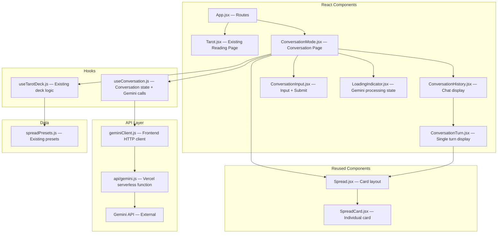
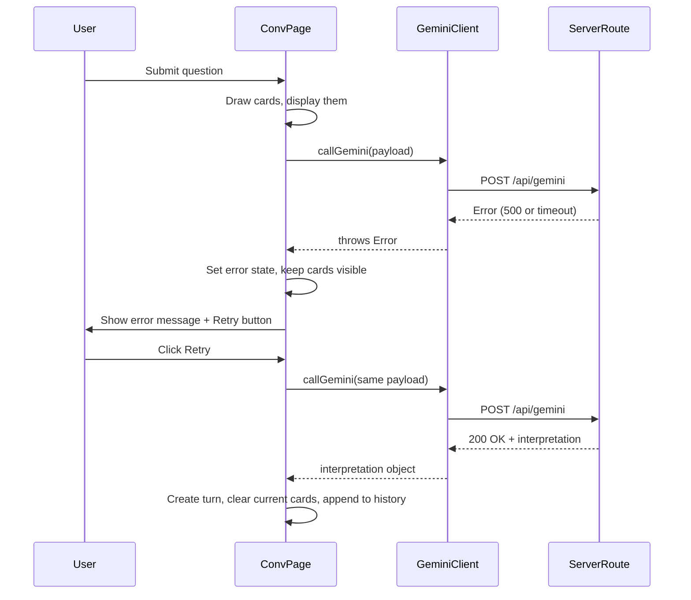

# Design Document: Conversation Mode with Gemini-Powered Tarot Interpretation

## Overview

This design extends the existing Tarot application with a Conversation Mode — a dedicated page at `/conversation` where users can ask multiple questions in sequence and receive AI-powered interpretations via the Gemini API. The feature reuses the existing deck logic (`useTarotDeck`), card rendering (`SpreadCard`, `Spread`), and spread presets without duplicating tarot functionality.

Key architectural decisions:
- **Vercel Serverless Function** — A new `api/gemini.js` endpoint handles all Gemini API communication server-side, keeping the API key secure
- **Dedicated Conversation Page** — A new route component (`ConversationMode.jsx`) lives alongside existing Tarot components
- **Custom Hook** — `useConversation.js` manages conversation state, turn sequencing, and the async Gemini call/response cycle
- **Reuse over Rebuild** — The page imports existing `useTarotDeck`, `Spread`, `SpreadCard`, and `SPREAD_PRESETS` directly

## Architecture



### Component Hierarchy

```
App.jsx
├── /tarot → Tarot.jsx (existing, unchanged)
└── /conversation → ConversationMode.jsx (new)
    ├── ConversationHistory.jsx
    │   └── ConversationTurn.jsx (repeated per turn)
    │       ├── Question display
    │       ├── Spread (reused) → SpreadCard (reused)
    │       └── Interpretation sections
    ├── Spread (reused, for current active reading)
    ├── LoadingIndicator.jsx
    └── ConversationInput.jsx (question input + submit button)
```

## Components and Interfaces

### ConversationMode (Main Page Component)

Orchestrates the conversation flow. Manages deck via existing hook, conversation via new hook.

```jsx
// src/components/Tarot/ConversationMode.jsx
const ConversationMode = () => {
  const { resetAndDraw, remainingCount } = useTarotDeck()
  const {
    turns,
    currentCards,
    isLoading,
    error,
    submitQuestion,
    retryLastInterpretation
  } = useConversation({ resetAndDraw })

  const [activePreset, setActivePreset] = useState(SPREAD_PRESETS.three)

  const handleSubmit = (questionText) => {
    submitQuestion(questionText, activePreset)
  }

  return (
    <section className={css.conversationWrapper}>
      <h1>Conversation Mode</h1>
      <ConversationHistory turns={turns} />
      {currentCards.length > 0 && (
        <Spread drawnCards={currentCards} spreadPreset={activePreset} />
      )}
      {isLoading && <LoadingIndicator />}
      {error && <ErrorMessage error={error} onRetry={retryLastInterpretation} />}
      <ConversationInput onSubmit={handleSubmit} disabled={isLoading} />
    </section>
  )
}
```

### ConversationInput

Question input with submit button. Prevents empty submissions.

```jsx
// src/components/Tarot/ConversationInput.jsx
const ConversationInput = ({ onSubmit, disabled }) => {
  const [text, setText] = useState('')

  const handleSubmit = () => {
    if (text.trim() === '' || disabled) return
    onSubmit(text.trim())
    setText('')
  }

  const handleKeyDown = (e) => {
    if (e.key === 'Enter') handleSubmit()
  }

  return (
    <div className={css.conversationInput}>
      <input
        type="text"
        placeholder="Ask a question for your tarot reading..."
        value={text}
        onChange={(e) => setText(e.target.value)}
        onKeyDown={handleKeyDown}
        disabled={disabled}
      />
      <button onClick={handleSubmit} disabled={disabled || text.trim() === ''}>
        Analyze
      </button>
    </div>
  )
}
```

### ConversationHistory

Scrollable display of all previous conversation turns.

```jsx
// src/components/Tarot/ConversationHistory.jsx
const ConversationHistory = ({ turns }) => {
  const bottomRef = useRef(null)

  useEffect(() => {
    bottomRef.current?.scrollIntoView({ behavior: 'smooth' })
  }, [turns.length])

  return (
    <div className={css.conversationHistory}>
      {turns.map(turn => (
        <ConversationTurn key={turn.id} turn={turn} />
      ))}
      <div ref={bottomRef} />
    </div>
  )
}
```

### ConversationTurn

Renders a single completed turn: question, cards, interpretation.

```jsx
// src/components/Tarot/ConversationTurn.jsx
const ConversationTurn = ({ turn }) => {
  return (
    <div className={css.conversationTurn}>
      <div className={css.turnQuestion}>
        <strong>You asked:</strong> {turn.question}
      </div>
      <Spread drawnCards={turn.cards} spreadPreset={turn.spreadPreset} />
      <div className={css.turnInterpretation}>
        {turn.interpretation.summary && (
          <section>
            <h4>Summary</h4>
            <p>{turn.interpretation.summary}</p>
          </section>
        )}
        {turn.interpretation.detailed && (
          <section>
            <h4>Interpretation</h4>
            <p>{turn.interpretation.detailed}</p>
          </section>
        )}
        {turn.interpretation.themes && (
          <section>
            <h4>Key Themes</h4>
            <p>{turn.interpretation.themes}</p>
          </section>
        )}
        {turn.interpretation.reflectionQuestions && (
          <section>
            <h4>Reflection Questions</h4>
            <p>{turn.interpretation.reflectionQuestions}</p>
          </section>
        )}
        {turn.interpretation.actionableInsights && (
          <section>
            <h4>Actionable Insights</h4>
            <p>{turn.interpretation.actionableInsights}</p>
          </section>
        )}
      </div>
    </div>
  )
}
```

### LoadingIndicator

Displayed while awaiting Gemini response.

```jsx
// src/components/Tarot/LoadingIndicator.jsx
const LoadingIndicator = () => (
  <div className={css.loadingIndicator}>
    <span className={css.spinner} />
    <p>Interpreting your cards...</p>
  </div>
)
```

### useConversation Hook

Manages conversation state, orchestrates the question→draw→interpret→reshuffle flow.

```jsx
// src/components/Tarot/hooks/useConversation.js
import { useState, useCallback } from 'react'
import { callGemini } from '../services/geminiClient'

const useConversation = ({ resetAndDraw }) => {
  const [turns, setTurns] = useState([])
  const [currentCards, setCurrentCards] = useState([])
  const [isLoading, setIsLoading] = useState(false)
  const [error, setError] = useState(null)
  const [pendingQuestion, setPendingQuestion] = useState(null)
  const [pendingPreset, setPendingPreset] = useState(null)

  const submitQuestion = useCallback(async (questionText, spreadPreset) => {
    setError(null)
    setIsLoading(true)
    setPendingQuestion(questionText)
    setPendingPreset(spreadPreset)

    // Step 1-2: Draw cards using existing deck logic
    const cards = resetAndDraw(spreadPreset.cardCount)
    setCurrentCards(cards)

    // Step 3: Call Gemini API
    try {
      const interpretation = await callGemini({
        question: questionText,
        cards: cards.map(c => ({ name: c.card.name, reversed: c.isReversed })),
        spreadType: spreadPreset.name
      })

      // Step 4: Create completed turn
      const turn = {
        id: crypto.randomUUID(),
        timestamp: new Date().toISOString(),
        question: questionText,
        cards,
        spreadPreset,
        interpretation
      }

      setTurns(prev => [...prev, turn])
      setCurrentCards([])
      setPendingQuestion(null)
      setPendingPreset(null)
    } catch (err) {
      setError(err.message || 'Unable to generate interpretation. Please try again.')
    } finally {
      setIsLoading(false)
    }
  }, [resetAndDraw])

  const retryLastInterpretation = useCallback(() => {
    if (pendingQuestion && pendingPreset) {
      // Retry with same cards already drawn (currentCards still visible)
      setError(null)
      setIsLoading(true)

      callGemini({
        question: pendingQuestion,
        cards: currentCards.map(c => ({ name: c.card.name, reversed: c.isReversed })),
        spreadType: pendingPreset.name
      }).then(interpretation => {
        const turn = {
          id: crypto.randomUUID(),
          timestamp: new Date().toISOString(),
          question: pendingQuestion,
          cards: currentCards,
          spreadPreset: pendingPreset,
          interpretation
        }
        setTurns(prev => [...prev, turn])
        setCurrentCards([])
        setPendingQuestion(null)
        setPendingPreset(null)
      }).catch(err => {
        setError(err.message || 'Unable to generate interpretation. Please try again.')
      }).finally(() => {
        setIsLoading(false)
      })
    }
  }, [pendingQuestion, pendingPreset, currentCards])

  return {
    turns,
    currentCards,
    isLoading,
    error,
    submitQuestion,
    retryLastInterpretation
  }
}

export default useConversation
```

### Gemini Client (Frontend HTTP Layer)

```jsx
// src/components/Tarot/services/geminiClient.js

const GEMINI_ENDPOINT = '/api/gemini'
const TIMEOUT_MS = 30000

/**
 * Calls the server-side Gemini API route.
 *
 * @param {{ question: string, cards: Array<{name: string, reversed: boolean}>, spreadType: string }} payload
 * @returns {Promise<GeminiInterpretation>}
 */
export const callGemini = async (payload) => {
  const controller = new AbortController()
  const timeoutId = setTimeout(() => controller.abort(), TIMEOUT_MS)

  try {
    const response = await fetch(GEMINI_ENDPOINT, {
      method: 'POST',
      headers: { 'Content-Type': 'application/json' },
      body: JSON.stringify(payload),
      signal: controller.signal
    })

    if (!response.ok) {
      throw new Error('Unable to generate interpretation. Please try again.')
    }

    return await response.json()
  } catch (err) {
    if (err.name === 'AbortError') {
      throw new Error('The interpretation service is taking longer than expected. Please try again.')
    }
    throw err
  } finally {
    clearTimeout(timeoutId)
  }
}
```

### Vercel Serverless Function

Vercel requires serverless functions in the root-level `api/` directory. The `api/gemini.js` file is a thin routing entry point that imports the handler logic from within the Tarot folder. This keeps all meaningful code in `src/components/Tarot/` for portability.

```javascript
// api/gemini.js (Vercel entry point — thin wrapper)
import handler from '../src/components/Tarot/services/geminiHandler.js'
export default handler
```

```javascript
// src/components/Tarot/services/geminiHandler.js (actual logic, lives in Tarot folder)
import { GoogleGenerativeAI } from '@google/generative-ai'

const SYSTEM_PROMPT = `You are an experienced tarot guide.

Tarot is a symbolic reflection tool for insight, self-exploration, journaling, and personal reflection.

Do not claim to predict the future.
Do not present interpretations as facts.
Interpret the cards symbolically and psychologically.
Use the user's question and the tarot cards together to create a thoughtful reading.

Provide your response in these sections:
1. Summary
2. Interpretation
3. Key Themes
4. Reflection Questions
5. Actionable Insights

Avoid fear-based language, certainty, supernatural claims, or deterministic predictions.
Maintain a warm, conversational tone.`

export default async function handler(req, res) {
  if (req.method !== 'POST') {
    return res.status(405).json({ error: 'Method not allowed' })
  }

  const apiKey = process.env.GEMINI_API_KEY
  const model = process.env.GEMINI_MODEL || 'gemini-2.5-flash'

  if (!apiKey) {
    return res.status(500).json({ error: 'Gemini API key not configured' })
  }

  const { question, cards, spreadType } = req.body

  if (!question || !cards || !Array.isArray(cards)) {
    return res.status(400).json({ error: 'Missing required fields: question, cards' })
  }

  const userPrompt = `Question: "${question}"

Spread Type: ${spreadType || 'General'}

Cards drawn:
${cards.map((c, i) => `${i + 1}. ${c.name}${c.reversed ? ' (Reversed)' : ' (Upright)'}`).join('\n')}

Please interpret these cards in relation to the question.`

  try {
    const genAI = new GoogleGenerativeAI(apiKey)
    const genModel = genAI.getGenerativeModel({
      model,
      systemInstruction: SYSTEM_PROMPT
    })

    const result = await genModel.generateContent(userPrompt)
    const text = result.response.text()

    // Parse sections from response
    const interpretation = parseSections(text)

    return res.status(200).json(interpretation)
  } catch (error) {
    console.error('Gemini API error:', error)
    return res.status(500).json({ error: 'Unable to generate interpretation. Please try again.' })
  }
}

function parseSections(text) {
  const sections = {
    summary: '',
    detailed: '',
    themes: '',
    reflectionQuestions: '',
    actionableInsights: ''
  }

  const sectionPatterns = [
    { key: 'summary', pattern: /(?:^|\n)#+?\s*(?:1\.?\s*)?Summary\s*\n([\s\S]*?)(?=\n#+?\s*(?:2\.?\s*)?(?:Interpretation|$))/i },
    { key: 'detailed', pattern: /(?:^|\n)#+?\s*(?:2\.?\s*)?Interpretation\s*\n([\s\S]*?)(?=\n#+?\s*(?:3\.?\s*)?(?:Key Themes|$))/i },
    { key: 'themes', pattern: /(?:^|\n)#+?\s*(?:3\.?\s*)?Key Themes\s*\n([\s\S]*?)(?=\n#+?\s*(?:4\.?\s*)?(?:Reflection Questions|$))/i },
    { key: 'reflectionQuestions', pattern: /(?:^|\n)#+?\s*(?:4\.?\s*)?Reflection Questions\s*\n([\s\S]*?)(?=\n#+?\s*(?:5\.?\s*)?(?:Actionable Insights|$))/i },
    { key: 'actionableInsights', pattern: /(?:^|\n)#+?\s*(?:5\.?\s*)?Actionable Insights\s*\n([\s\S]*?)$/i }
  ]

  for (const { key, pattern } of sectionPatterns) {
    const match = text.match(pattern)
    if (match) {
      sections[key] = match[1].trim()
    }
  }

  // Fallback: if no sections matched, put everything in summary
  if (!sections.summary && !sections.detailed) {
    sections.summary = text.trim()
  }

  return sections
}
```

## Data Models

### ConversationTurn

```typescript
interface ConversationTurn {
  id: string                    // crypto.randomUUID()
  timestamp: string             // ISO 8601 string
  question: string              // User's question text
  cards: DrawnCard[]            // Array of drawn cards with reversal status
  spreadPreset: SpreadPreset   // Preset used for this turn
  interpretation: GeminiInterpretation  // Parsed Gemini response
}
```

### GeminiInterpretation

```typescript
interface GeminiInterpretation {
  summary: string              // Overall reading summary
  detailed: string             // Detailed card interpretation
  themes: string               // Key themes and patterns
  reflectionQuestions: string   // Questions for self-reflection
  actionableInsights: string   // Practical next steps
}
```

### GeminiRequestPayload

```typescript
interface GeminiRequestPayload {
  question: string             // User's question
  cards: CardPayload[]         // Simplified card data for API
  spreadType: string           // Name of spread preset used
}

interface CardPayload {
  name: string                 // Card name (e.g., "The Star")
  reversed: boolean            // Whether card is reversed
}
```

### Reused Data Models (from existing app)

- **DrawnCard** — `{ card: Card, isReversed: boolean }`
- **Card** — Full card object from `tarotDeck.js`
- **SpreadPreset** — `{ name: string, cardCount: number, labels: string[] }`


## Correctness Properties

*A property is a characteristic or behavior that should hold true across all valid executions of a system — essentially, a formal statement about what the system should do. Properties serve as the bridge between human-readable specifications and machine-verifiable correctness guarantees.*

### Property 1: Card Count Matches Spread Preset

*For any* spread preset and any submitted question, the number of cards drawn SHALL equal the preset's `cardCount` value.

**Validates: Requirements 3.2, 3.3**

### Property 2: Empty Question Rejection

*For any* string composed entirely of whitespace (including the empty string), submitting it SHALL be rejected and the conversation state SHALL remain unchanged (no new turn, no cards drawn).

**Validates: Requirements 3.5**

### Property 3: Gemini Payload Completeness

*For any* submitted question and set of drawn cards, the payload sent to the server route SHALL contain the question text, an array of card objects each with a name and reversed boolean, and the spread type string.

**Validates: Requirements 4.1**

### Property 4: Conversation History Accumulation

*For any* sequence of N successfully completed questions (N ≥ 1), the conversation history SHALL contain exactly N turns, each preserving the original question, cards, and interpretation from that turn.

**Validates: Requirements 6.1, 6.2, 7.1, 7.2, 7.3**

### Property 5: Turn Structural Invariant

*For any* completed conversation turn, it SHALL contain a unique non-empty identifier, a valid ISO 8601 timestamp, non-empty question text, a non-empty array of drawn cards with reversal status, and a non-empty interpretation object.

**Validates: Requirements 9.1, 9.3**

### Property 6: Cards Remain Visible On Error

*For any* Gemini API failure after cards have been drawn, the drawn cards SHALL remain in the current cards state and be available for display.

**Validates: Requirements 8.2**

### Property 7: Interpretation Section Parsing

*For any* valid Gemini response text containing labeled sections (Summary, Interpretation, Key Themes, Reflection Questions, Actionable Insights), the `parseSections` function SHALL extract each section's content into the corresponding field of the interpretation object.

**Validates: Requirements 4.4**

## Error Handling

| Error Condition | Handling Strategy |
|----------------|-------------------|
| Gemini API failure (network/server error) | Display "Unable to generate interpretation. Please try again." Keep drawn cards visible. Show retry button. |
| Gemini API timeout (>30s) | AbortController cancels request. Display "The interpretation service is taking longer than expected. Please try again." |
| Missing API key on server | Return 500 with "Gemini API key not configured" (logged server-side only) |
| Invalid request payload | Return 400 with descriptive error message |
| Empty question submission | Prevent submission at the UI layer (button disabled, Enter key blocked) |
| Gemini response parse failure | Fall back to putting entire response text in `summary` field |
| Method not POST | Return 405 "Method not allowed" |

### Error Recovery Flow



## Testing Strategy

### Dual Testing Approach

- **Unit tests**: Verify specific examples (component rendering, API route logic, error scenarios, payload format)
- **Property tests**: Verify universal invariants across randomized inputs (turn structure, history accumulation, payload completeness, section parsing)

### Property-Based Testing Configuration

- **Library**: fast-check (already installed)
- **Test runner**: vitest (already configured)
- **Minimum iterations**: 100 per property test
- **Tag format**: `Feature: tarot-conversation-mode, Property {number}: {property_text}`

### Unit Test Coverage

| Test Area | Test Cases |
|-----------|------------|
| ConversationInput | Prevents empty submission; clears input after submit; Enter key submits; disabled during loading |
| ConversationHistory | Renders all turns; auto-scrolls to bottom on new turn |
| ConversationTurn | Renders question, cards, and all interpretation sections |
| ConversationMode | Full flow: submit → draw → interpret → append turn; error state renders retry |
| LoadingIndicator | Renders spinner and message |
| geminiClient | Handles success response; throws on non-OK response; throws timeout message on AbortError |
| api/gemini.js | Returns 405 for non-POST; returns 400 for missing fields; returns 500 when no API key; calls Gemini with correct prompt; parses sections correctly |

### Property Test Plan

| Property | Test Strategy |
|----------|---------------|
| Property 1: Card Count | Generate random preset selections; verify drawn card count equals preset.cardCount |
| Property 2: Empty Rejection | Generate random whitespace strings; verify no state change after submission attempt |
| Property 3: Payload Completeness | Generate random questions + card arrays; verify all fields present in payload |
| Property 4: History Accumulation | Generate sequences of 1-10 questions; verify history.length equals completed count |
| Property 5: Turn Structure | Generate random turns; verify all required fields present, IDs unique, timestamps valid |
| Property 6: Cards On Error | Simulate errors after draws; verify currentCards state unchanged |
| Property 7: Section Parsing | Generate mock Gemini responses with various section formats; verify parsed output matches |

### Test File Structure

```
tests/
└── unit/
    ├── useConversation.test.js          (unit + property tests for conversation hook)
    ├── geminiClient.test.js             (unit tests for HTTP client)
    ├── geminiHandler.test.js            (unit tests for server handler logic)
    ├── ConversationMode.test.jsx        (integration tests)
    ├── ConversationInput.test.jsx       (unit tests)
    └── ConversationHistory.test.jsx     (unit tests)
```

### File Organization (all in Tarot folder)

```
src/components/Tarot/
├── ConversationMode.jsx                 (main page component)
├── ConversationInput.jsx                (question input + submit)
├── ConversationHistory.jsx              (scrollable turn list)
├── ConversationTurn.jsx                 (single turn display)
├── LoadingIndicator.jsx                 (loading state)
├── hooks/
│   └── useConversation.js              (conversation state + flow)
├── services/
│   ├── geminiClient.js                 (frontend HTTP client)
│   └── geminiHandler.js                (server-side Gemini handler logic)
└── ...existing files unchanged...

api/
└── gemini.js                           (Vercel entry point — thin import from Tarot/services)
```
