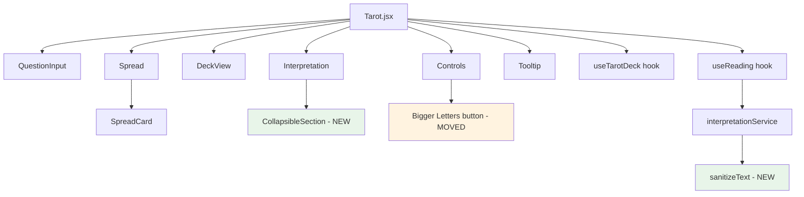

# Design Document: Tarot UX Fixes

## Overview

This design covers a batch of UI/UX improvements to the existing Tarot app. The changes span eight areas: replacing the unclear text-size toggle, normalizing card sizing, adding mobile tooltip support, improving reset completeness, sanitizing generated text, redesigning the card layout for screenshotability, adding collapsible interpretation sections, and making Analyze always produce a fresh reading.

The implementation stays within the existing React + Vite + framer-motion + SCSS modules stack. No new major dependencies are introduced beyond what's already in use (vitest + fast-check for testing).

## Architecture

The changes are primarily component-level refactors with one new utility module (sanitizer). No architectural changes to the hook/service layer are needed — only behavioral modifications to existing hooks and the addition of the sanitizer in the rendering pipeline.



### Component Render Order (Post-Redesign)

```
Tarot.jsx
├── Header (title + subtitle)
├── QuestionInput (textarea + Analyze + Reset)
├── Spread (drawn cards — flexbox wrap)
├── DeckView (remaining deck visual)
├── Controls (Bigger Letters, Shuffle, Auto Mode, Presets)
└── Interpretation (collapsible sections)
```

## Components and Interfaces

### 1. Tooltip Component (Modified)

**File:** `src/components/Tarot/Tooltip.jsx`

```jsx
const Tooltip = ({ text, children }) => {
  // State: visible (boolean)
  // Desktop: onMouseEnter → show, onMouseLeave → hide
  // Mobile: onTouchEnd → toggle visibility
  // Dismiss: click-outside listener when visible on touch
  // A11y: aria-describedby on children, role="tooltip" on tooltip element
}
```

Key changes:
- Replace `onDoubleClick` with single-tap toggle via `onTouchEnd`
- Add a document-level click-outside listener (registered only when tooltip is visible on touch)
- Add `aria-describedby` linking the trigger to tooltip content
- Prevent event propagation conflicts between touch and mouse events using `onTouchEnd` + `e.preventDefault()`

### 2. CollapsibleSection Component (New)

**File:** `src/components/Tarot/CollapsibleSection.jsx`

```jsx
const CollapsibleSection = ({ title, defaultOpen, children }) => {
  // State: isOpen (boolean), defaults based on prop
  // Renders: clickable header with chevron indicator
  // A11y: button with aria-expanded, controls panel via aria-controls
  // Keyboard: Enter/Space toggles
  // Animation: framer-motion AnimatePresence for smooth expand/collapse
}
```

### 3. Interpretation Component (Modified)

**File:** `src/components/Tarot/Interpretation.jsx`

```jsx
const Interpretation = ({ reading, isGenerating }) => {
  // State: allExpanded (boolean for Collapse All / Expand All)
  // Uses useMediaQuery or window.matchMedia to determine default state
  // Wraps each section (summary, reflections, connections) in CollapsibleSection
  // Provides Collapse All / Expand All buttons
  // Desktop default: expanded
  // Mobile default: collapsed
}
```

### 4. Controls Component (Modified)

**File:** `src/components/Tarot/Controls.jsx`

- Add "Bigger Letters" / "Smaller Letters" toggle button to the actions row
- Props: receives `largeText` state and `onToggleTextSize` callback from parent
- Button uses `aria-pressed={largeText}` for screen reader state communication

### 5. Tarot.jsx (Modified)

Key changes:
- Remove the `textSizeBtn` from the header
- Pass `largeText` + toggle handler down to Controls
- Reorder component rendering to: QuestionInput → Spread → DeckView → Controls → Interpretation
- `handleReset`: additionally calls `setQuestion('')` to clear question field
- `handleAnalyze`: always does resetAndDraw → analyze (fresh reading every time)
- Persist `largeText` to `sessionStorage` on change, initialize from `sessionStorage`

### 6. sanitizeText Utility (New)

**File:** `src/components/Tarot/utils/sanitizeText.js`

```javascript
export function sanitizeText(text) {
  // 1. Remove malformed punctuation sequences: ".,", ",.", ".,."
  // 2. Collapse repeated punctuation: ".." → ".", ",," → ","
  //    (preserve "..." ellipsis — only collapse 2 consecutive, not 3)
  // 3. Normalize spacing around punctuation: "word , word" → "word, word"
  // 4. Trim extra whitespace
  // Returns cleaned string
}
```

Applied in `Interpretation.jsx` before rendering text, or in `interpretationService.js` at the output boundary.

### 7. SpreadCard & Spread (Modified)

- SpreadCard: Remove variable width, use CSS class with fixed responsive dimensions
- Spread: Ensure flexbox with consistent `gap`, `justify-content: center`, and `flex-wrap: wrap`
- SCSS: Unify `.spreadCard` width/height at each breakpoint instead of allowing content-driven sizing

## Data Models

No new data models are introduced. The existing state shape remains:

```typescript
// Existing state (no changes)
interface DrawnCard {
  card: TarotCard
  isReversed: boolean
}

interface Interpretation {
  summary: string
  reflections: string[]
  connections: string
}

// New session-persisted state
// Key: "tarot-large-text" in sessionStorage
// Value: "true" | "false"
```

### Collapse State (Component-Local)

```typescript
// Internal to Interpretation component
interface CollapseState {
  allExpanded: boolean  // drives Collapse All / Expand All
}

// Internal to each CollapsibleSection
interface SectionState {
  isOpen: boolean
}
```


## Correctness Properties

*A property is a characteristic or behavior that should hold true across all valid executions of a system — essentially, a formal statement about what the system should do. Properties serve as the bridge between human-readable specifications and machine-verifiable correctness guarantees.*

### Property 1: Text size session persistence (round-trip)

*For any* toggle of Text_Size_Mode, writing the state to sessionStorage and then reading it back on component mount SHALL produce the same boolean value that was stored.

**Validates: Requirements 1.5**

### Property 2: Tooltip shows on interaction

*For any* Tooltip_Component instance, triggering the show interaction (mouseenter on desktop, tap on touch) SHALL result in the tooltip becoming visible (DOM element present with tooltip text content).

**Validates: Requirements 3.1, 3.2**

### Property 3: Tooltip dismiss behavior

*For any* visible Tooltip_Component on a touch device, either tapping the same trigger again or tapping outside the tooltip-wrapped element SHALL result in the tooltip being hidden.

**Validates: Requirements 3.3, 3.4**

### Property 4: Reset clears all state

*For any* app state containing drawn cards, interpretation content, question text, or active preset, calling the reset action SHALL produce a state where drawnCards is empty, interpretation is null, question is empty string, and activePreset is null.

**Validates: Requirements 4.1, 4.2, 4.3, 4.4, 4.5**

### Property 5: Sanitizer removes malformed punctuation

*For any* string, after applying sanitizeText: no malformed sequences (".,", ",.", ".,.") remain, no double commas or double periods (excluding ellipsis) remain, and no spaces appear before commas or periods.

**Validates: Requirements 5.1, 5.2, 5.3**

### Property 6: Sanitizer idempotence

*For any* string, `sanitizeText(sanitizeText(s))` SHALL equal `sanitizeText(s)`.

**Validates: Requirements 5.5**

### Property 7: Collapsible section toggle

*For any* CollapsibleSection instance in a given state (open or closed), clicking the header SHALL result in the opposite state (closed or open respectively).

**Validates: Requirements 7.2**

### Property 8: Collapsible keyboard accessibility

*For any* CollapsibleSection control, pressing Enter or Space when focused SHALL toggle the expanded/collapsed state identically to a click.

**Validates: Requirements 7.6**

### Property 9: Collapsible ARIA state accuracy

*For any* CollapsibleSection, the `aria-expanded` attribute on the control element SHALL match the actual visibility state of the content panel (true when open, false when closed).

**Validates: Requirements 7.7, 10.3**

### Property 10: Analyze produces fresh reading

*For any* app state (with or without existing cards/interpretation), calling Analyze SHALL produce a state equivalent to: reset all state → draw fresh cards from reshuffled deck → generate interpretation for those cards. Specifically: drawnCards are new, interpretation is non-null, and old cards/interpretation are gone.

**Validates: Requirements 8.1, 8.2, 8.3, 8.4**

### Property 11: Tooltip ARIA describedby

*For any* Tooltip_Component instance, the trigger element SHALL have an `aria-describedby` attribute whose value references an element containing the tooltip text.

**Validates: Requirements 10.2**

### Property 12: Bigger Letters aria-pressed accuracy

*For any* state of the "Bigger Letters" button, the `aria-pressed` attribute SHALL equal the current `largeText` boolean state (true when active, false when inactive).

**Validates: Requirements 10.4**

## Error Handling

| Scenario | Handling |
|----------|----------|
| Interpretation generation throws | Display drawn cards normally; show error message in Interpretation area; do not lose card state |
| sessionStorage unavailable | Fall back to in-memory state; text size toggle still works for current page lifecycle |
| Tooltip outside-click race condition | Use `requestAnimationFrame` or event ordering to avoid immediately re-showing after dismiss |
| Empty/null text passed to sanitizer | Return empty string without throwing |

## Testing Strategy

### Property-Based Tests (fast-check)

Each correctness property above gets a dedicated property-based test with minimum 100 iterations. Tests are tagged with:

```
Feature: tarot-ux-fixes, Property N: <property title>
```

**Library:** fast-check (already in project)

Property tests focus on:
- **Property 5 & 6** (sanitizer): Generate arbitrary strings containing punctuation patterns and verify postconditions hold
- **Property 4** (reset): Generate arbitrary app states and verify reset invariant
- **Property 10** (analyze): Generate arbitrary pre-existing states and verify analyze produces fresh state

### Unit Tests (vitest)

Unit tests cover specific examples and edge cases:
- Tooltip: specific interaction sequences (hover, tap, tap-outside)
- CollapsibleSection: keyboard events, ARIA attributes, default states per viewport
- Sanitizer edge cases: ellipsis preservation, already-clean text passes through unchanged
- Reset: specific scenario with all fields populated
- Analyze: scenario with existing cards vs. empty state
- Layout: DOM render order verification
- Text size: button label toggle, sessionStorage read/write

### Test File Locations

```
tests/unit/sanitizeText.test.js        — Properties 5, 6
tests/unit/tooltip.test.js             — Properties 2, 3, 11
tests/unit/collapsibleSection.test.js  — Properties 7, 8, 9
tests/unit/tarotReset.test.js          — Property 4
tests/unit/tarotAnalyze.test.js        — Property 10
tests/unit/textSizeToggle.test.js      — Properties 1, 12
```
