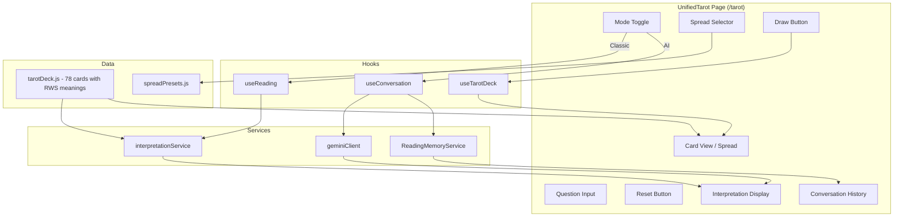

# Design Document: Tarot UX Redesign

## Overview

This design unifies the existing /tarot and /conversation pages into a single `UnifiedTarot` component at /tarot. The page provides two modes—Classic (client-side, free) and AI Reading (Gemini-powered)—selected via a toggle. Controls are reduced to a spread selector (3 options), optional question input, a Draw button, and a Reset button. The existing `useTarotDeck` hook remains the source of truth for all deck operations. The `useConversation` hook and `ReadingMemoryService` power the AI mode's multi-turn conversation. A new `interpretationService` rewrite provides spread-aware static readings for Classic mode, while an updated Gemini system prompt handles context-aware interpretations for AI mode.

## Architecture



## Components and Interfaces

### UnifiedTarot (replaces Tarot.jsx + ConversationMode.jsx)

The top-level page component managing mode state and orchestrating sub-components.

```jsx
// State
const [mode, setMode] = useState('classic') // 'classic' | 'ai'
const [selectedSpread, setSelectedSpread] = useState('single')
```

Props flow:
- `ModeToggle`: receives `mode`, `onModeChange`
- `SpreadSelector`: receives `selectedSpread`, `onSpreadChange`
- `QuestionInput`: receives `question`, `onQuestionChange`, `onSubmit`
- `DrawButton`: receives `onDraw`, `isLoading`
- `CardSpread`: receives `drawnCards`, `spreadPreset`
- `InterpretationDisplay`: receives `interpretation`, `isLoading` (Classic: static obj, AI: Gemini response)
- `ConversationHistory`: receives `turns` (AI mode only)
- `ResetButton`: receives `onReset`

### ModeToggle (new component)

A pill/tab-style toggle between "Classic" and "AI Reading".

```jsx
const ModeToggle = ({ mode, onModeChange }) => (
  <div className={css.modeToggle} role="tablist">
    <button role="tab" aria-selected={mode === 'classic'} onClick={() => onModeChange('classic')}>
      Classic
    </button>
    <button role="tab" aria-selected={mode === 'ai'} onClick={() => onModeChange('ai')}>
      AI Reading
    </button>
  </div>
)
```

### SpreadSelector (new component, replaces Controls presets + auto mode)

Three-button selector for spread type.

```jsx
const SpreadSelector = ({ selectedSpread, onSpreadChange }) => (
  <div className={css.spreadSelector} role="radiogroup" aria-label="Spread type">
    {['single', 'three', 'celtic'].map(key => (
      <button
        key={key}
        role="radio"
        aria-checked={selectedSpread === key}
        onClick={() => onSpreadChange(key)}
      >
        {SPREAD_PRESETS[key].name}
      </button>
    ))}
  </div>
)
```

### InterpretationDisplay (refactored from Interpretation.jsx)

Renders either the static Classic interpretation or the structured AI interpretation. The component accepts a generic `interpretation` object and an `isAI` flag to determine rendering.

### ConversationHistory (reused from existing ConversationHistory/ConversationTurn components)

Displays the multi-turn AI conversation below the current reading. Only rendered in AI mode when turns exist.

### Removed Components
- `Controls.jsx` — replaced by SpreadSelector + simplified buttons
- `DeckView.jsx` — removed (no clickable deck, no deck count)
- `ConversationMode.jsx` — merged into UnifiedTarot

### Preserved Components (adapted)
- `Spread.jsx` / `SpreadCard.jsx` — card layout (unchanged interface)
- `QuestionInput.jsx` — reused, minor prop changes
- `ConversationTurn.jsx` — reused within ConversationHistory
- `LoadingIndicator.jsx` — reused
- `Tooltip.jsx` — reused for text size toggle
- `CollapsibleSection.jsx` — potentially useful for conversation history

## Data Models

### Card Data (tarotDeck.js — updated structure)

Each card in the deck array gains a `keywords` field:

```javascript
{
  name: "The Fool",
  name_short: "ar00",
  type: "major",        // "major" | "minor"
  suit: null,           // null | "wands" | "cups" | "swords" | "pentacles"
  desc: "A young traveler steps toward a cliff edge...",
  meaning_up: "New beginnings, innocence, spontaneity. The Fool steps forward...",
  meaning_rev: "Recklessness, fear of the unknown, poor judgment...",
  keywords: ["beginnings", "innocence", "leap of faith"]
}
```

### Static Interpretation Object (Classic Mode)

```javascript
{
  summary: string,           // Overall reading summary
  cardReadings: [            // Per-card interpretation
    {
      cardName: string,
      position: string,      // From spread labels: "Past", "Present", etc.
      isReversed: boolean,
      meaning: string        // The upright or reversed meaning text
    }
  ],
  spreadInsight: string      // Position-aware narrative connecting the cards
}
```

### AI Interpretation Object (from Gemini, existing structure)

```javascript
{
  summary: string,
  detailed: string,
  themes: string,
  reflectionQuestions: string,
  actionableInsights: string
}
```

### Question Type Categories

```javascript
const QUESTION_TYPES = {
  LOVE: 'love',
  CAREER: 'career',
  SELF: 'self',
  GENERAL: 'general'
}
```

Detection uses keyword matching in the system prompt (not client-side logic). The Gemini system prompt instructions include question-type detection and perspective adaptation.

### Updated Gemini System Prompt

```
You are an experienced tarot reader in the Rider-Waite-Smith tradition.

QUESTION TYPE DETECTION:
Analyze the user's question to determine its primary focus:
- Love/Relationships: questions about partners, feelings, connections, dating, marriage
- Career/Professional: questions about work, money, business, direction, timing
- Self/Growth: questions about identity, healing, purpose, spirituality, personal development
- General: questions that don't fit clearly into the above, or no question provided

INTERPRETATION PERSPECTIVE:
Adapt your reading style to the detected question type:
- Love: "The cards suggest they feel..." / "In your connection..." — focus on emotional dynamics
- Career: "Professionally, this points to..." / "The timing suggests..." — focus on practical direction
- Self: "This invites you to reflect on..." / "Your inner landscape shows..." — focus on introspection
- General: provide a balanced multi-angle interpretation

RESPONSE STRUCTURE:
1. Brief Insight (2-3 sentences capturing the reading's essence)
2. Card-by-Card (reference traditional RWS imagery, numerology, suit elements)
3. Thematic Connections (how the cards relate to each other and the question)
4. One Reflection Question (to close)

RULES:
- Reference traditional symbolism: imagery, colors, numerology, suit elements (Fire/Water/Air/Earth)
- Maintain a warm, conversational, non-deterministic tone
- Never predict the future or make claims of certainty
- Frame everything as reflection and exploration
- Do not use fear-based language
```

## Routing Changes

```javascript
// In router config
{ path: '/tarot', element: <UnifiedTarot /> }
{ path: '/conversation', element: <Navigate to="/tarot?mode=ai" replace /> }
```

The redirect passes `?mode=ai` so UnifiedTarot can initialize in AI mode for backward-compatible links.


## Correctness Properties

*A property is a characteristic or behavior that should hold true across all valid executions of a system—essentially, a formal statement about what the system should do. Properties serve as the bridge between human-readable specifications and machine-verifiable correctness guarantees.*

### Property 1: Draw count matches spread selection

*For any* spread selection (single, three, celtic), when the Draw button is clicked, the number of cards drawn SHALL equal the spread's defined cardCount (1, 3, or 10 respectively).

**Validates: Requirements 3.1**

### Property 2: Card meaning matches orientation

*For any* drawn card, the meaning text displayed in Classic mode SHALL be the card's `meaning_up` value when the card is upright, and the card's `meaning_rev` value when the card is reversed.

**Validates: Requirements 3.2**

### Property 3: Static interpretation produced for any valid input

*For any* spread type and any set of drawn cards with valid positions, calling the static interpretation function SHALL produce a non-empty result containing a summary, per-card readings matching the number of drawn cards, and a spread insight string.

**Validates: Requirements 3.3**

### Property 4: Reset clears all state

*For any* state of the application (any combination of drawn cards, question text, and interpretation), invoking reset SHALL result in zero drawn cards, an empty question string, and a null interpretation.

**Validates: Requirements 3.5**

### Property 5: AI mode sends correct payload

*For any* question string and spread selection in AI mode, the payload sent to the Gemini API SHALL contain: the question text, an array of card objects with length equal to the spread's cardCount, and the spread type name.

**Validates: Requirements 4.1**

### Property 6: ReadingMemoryService preserves turn order

*For any* sequence of turns added to ReadingMemoryService, calling getSessionHistory() SHALL return the turns in the same order they were added, with matching role and content values.

**Validates: Requirements 4.4**

### Property 7: parseSections extracts structured sections from formatted text

*For any* text formatted with the expected section headers (Summary, Interpretation, Key Themes, Reflection Questions, Actionable Insights), parseSections SHALL extract non-empty content into the corresponding fields of the returned object.

**Validates: Requirements 5.7**

### Property 8: Deck contains 78 cards with correct type distribution

*For all* entries in the tarot deck data, the total count SHALL be 78, with exactly 22 entries where type is "major" and exactly 56 entries where type is "minor".

**Validates: Requirements 6.1**

### Property 9: All cards have appropriately-lengthed meanings

*For any* card in the deck, both `meaning_up` and `meaning_rev` SHALL contain between 2 and 3 sentences (determined by sentence-ending punctuation).

**Validates: Requirements 6.2, 6.3**

### Property 10: All cards have 3-5 keywords

*For any* card in the deck, the `keywords` array SHALL have a length between 3 and 5 inclusive.

**Validates: Requirements 6.4**

### Property 11: Analytics events fire for completed readings

*For any* completed card draw operation (in either mode), the TAROT_READING_STARTED event SHALL fire before the interpretation is generated, and the TAROT_READING_GENERATED event SHALL fire after interpretation completes.

**Validates: Requirements 9.1, 9.2**

### Property 12: Analytics event fires on follow-up questions

*For any* follow-up question submitted in AI mode, the FOLLOW_UP_QUESTION_ASKED analytics event SHALL fire.

**Validates: Requirements 9.3**

### Property 13: Analytics event fires on mode switch

*For any* mode toggle interaction, an analytics event indicating the new mode SHALL fire.

**Validates: Requirements 9.4**

### Property 14: Drawn cards have randomized reversal assignment

*For any* draw operation, each card in the result SHALL have an `isReversed` boolean property. Over a sufficient sample of draws, the distribution of reversed cards SHALL be approximately 50% (validating randomization, not a fixed assignment).

**Validates: Requirements 10.2**

## Error Handling

| Scenario | Handling |
|----------|----------|
| Gemini API timeout (30s) | AbortController cancels request; error message displayed with retry button |
| Gemini API 4xx/5xx | Error message displayed: "Unable to generate interpretation. Please try again." with retry button |
| Network offline in AI mode | Fetch fails; same error UI with retry |
| Empty question in AI mode | Allow draw without question (question is optional); system prompt handles "no question" case |
| sessionStorage unavailable | ReadingMemoryService falls back to in-memory (existing behavior) |
| Invalid route /conversation | Redirect to /tarot?mode=ai (Navigate with replace) |
| Card deck data corruption | Static assertion at build time via property tests (Property 8, 9, 10) |

## Testing Strategy

### Property-Based Testing

Library: **fast-check** (already used in the project)

Each property test runs a minimum of 100 iterations. Tests are tagged with their design property reference.

| Property | Test Approach |
|----------|--------------|
| P1: Draw count matches spread | Generate random spread keys → draw → assert count |
| P2: Card meaning matches orientation | Generate random cards with random reversals → assert correct meaning selected |
| P3: Static interpretation for any input | Generate random card arrays and spread types → assert non-empty structured output |
| P4: Reset clears state | Generate random states → reset → assert all fields empty |
| P5: AI payload correctness | Generate random questions + spreads → mock fetch → assert payload shape |
| P6: Memory turn order | Generate random turn sequences → add → assert order preserved |
| P7: parseSections | Generate valid formatted text with all headers → parse → assert fields populated |
| P8: Deck integrity | Static assertion on imported deck data (runs once, validates invariant) |
| P9: Card meaning length | Iterate all 78 cards → assert sentence count in range |
| P10: Keywords count | Iterate all 78 cards → assert keywords array length 3-5 |
| P11: Reading analytics | Generate random draw scenarios → mock analytics → assert both events fire |
| P12: Follow-up analytics | Generate random follow-up submissions → mock analytics → assert event fires |
| P13: Mode switch analytics | Generate random toggle sequences → mock analytics → assert event fires each time |
| P14: Reversal randomization | Draw many cards → assert reversal ratio within statistical bounds |

### Unit Testing

Unit tests complement property tests for specific examples and edge cases:

- ModeToggle renders correct aria attributes for each mode
- SpreadSelector highlights the selected spread
- /conversation route redirects to /tarot?mode=ai
- Error display appears when Gemini call fails
- Reset button clears all UI state
- Text size toggle persists to sessionStorage
- Classic mode never calls fetch (mock assertion)
- Celtic Cross spread renders all 10 position labels

### Integration Testing

- Full Classic mode flow: select spread → draw → see interpretation (no API calls)
- Full AI mode flow: select spread → enter question → draw → mock API returns → see interpretation → submit follow-up
- Mode switching mid-reading preserves/clears state appropriately
