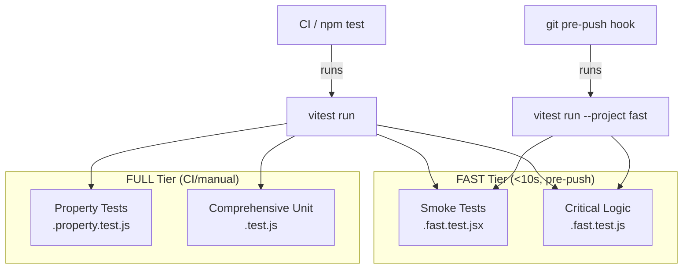

# Design Document: Test Suite Architecture

## Overview

This design establishes a two-tier test architecture using Vitest's project workspace feature to separate fast pre-push tests from comprehensive CI tests. The architecture leverages file naming conventions for tier assignment, a git pre-push hook for gating, and organizes tests into smoke, unit, and property categories.

The key design decision is using **file suffixes** (`.fast.test.js`, `.property.test.js`, `.test.js`) rather than Vitest tags or separate config files. This keeps the mental model simple: the file name tells you when it runs.

## Architecture



### Tier Strategy

| Tier | Trigger | Include Patterns | Target Time |
|------|---------|-----------------|-------------|
| FAST | `npm run test:fast`, pre-push hook | `**/*.fast.test.{js,jsx}` | <10s |
| FULL | `npm test`, CI pipeline | `**/*.{test,fast.test,property.test}.{js,jsx}` | ~30-60s |

### Directory Structure

```
tests/
├── smoke/                          # Component render smoke tests (FAST)
│   ├── ConversationMode.fast.test.jsx
│   └── Tarot.fast.test.jsx
├── unit/                           # Critical business logic (FAST + FULL)
│   ├── geminiClient.fast.test.js
│   ├── interpretationService.fast.test.js
│   ├── useConversation.fast.test.js
│   ├── useTarotDeck.test.js        # existing, FULL only
│   ├── useReading.test.js          # existing, FULL only
│   ├── readingMemoryService.test.js # existing, FULL only
│   ├── sanitizeText.test.js        # existing, FULL only
│   └── ...
├── property/                       # Property-based tests (FULL only)
│   └── deckRandomization.property.test.js
└── helpers/
    └── renderWithProviders.jsx     # Shared test utilities
```

## Components and Interfaces

### 1. Vitest Configuration (vitest.config.js)

Uses Vitest's `--project` flag with workspace configuration to define two projects sharing a single config file:

```javascript
// vitest.config.js
import { defineConfig } from 'vitest/config'
import react from '@vitejs/plugin-react'

export default defineConfig({
  plugins: [react()],
  test: {
    globals: true,
    environment: 'jsdom',
    projects: [
      {
        name: 'fast',
        test: {
          include: ['tests/**/*.fast.test.{js,jsx}'],
        }
      },
      {
        name: 'full',
        test: {
          include: ['tests/**/*.{test,fast.test,property.test}.{js,jsx}'],
        }
      }
    ]
  },
})
```

### 2. Package.json Scripts

```json
{
  "scripts": {
    "test": "vitest run",
    "test:fast": "vitest run --project fast",
    "test:full": "vitest run --project full",
    "test:watch": "vitest",
    "test:install-hooks": "node scripts/install-hooks.js"
  }
}
```

### 3. Pre-Push Hook (scripts/install-hooks.js + .githooks/pre-push)

The hook lives in `.githooks/pre-push` (committed to repo). A simple installer script copies it into `.git/hooks/`. Developers run `npm run test:install-hooks` once after clone.

```bash
#!/bin/sh
# .githooks/pre-push
echo "Running pre-push tests..."
npm run test:fast
if [ $? -ne 0 ]; then
  echo "Pre-push tests failed. Push blocked."
  exit 1
fi
```

### 4. Test Helper: renderWithProviders

A shared utility that wraps components in necessary providers (MemoryRouter, etc.):

```javascript
// tests/helpers/renderWithProviders.jsx
import { render } from '@testing-library/react'
import { MemoryRouter } from 'react-router-dom'

export function renderWithProviders(ui, { route = '/', ...options } = {}) {
  return render(
    <MemoryRouter initialEntries={[route]}>{ui}</MemoryRouter>,
    options
  )
}
```

### 5. Gemini Client Test Strategy

The geminiClient module uses `fetch` internally. Tests will mock `globalThis.fetch` to simulate:
- Successful responses
- 5xx responses (verify retry)
- 4xx responses (verify no retry)
- AbortError (verify timeout + retry)
- Exhausted retries (verify final throw)

This avoids any external mocking libraries — just `vi.fn()` on `globalThis.fetch`.

### 6. Conversation Hook Test Strategy

The useConversation hook depends on:
- `callGemini` (mock the module)
- `generateInterpretation` (mock for isolation, or let it run since it's sync and fast)
- `ReadingMemoryService` (let it use jsdom's localStorage)
- `resetAndDraw` (pass a mock function)

Tests will use `@testing-library/react`'s `renderHook` with `act()` for state transitions.

## Data Models

### Test File Naming Convention

| Suffix | Tier Membership | Purpose |
|--------|----------------|---------|
| `.fast.test.js` / `.fast.test.jsx` | FAST + FULL | Smoke tests, critical logic |
| `.property.test.js` | FULL only | Property-based tests with fast-check |
| `.test.js` / `.test.jsx` | FULL only | Comprehensive unit/integration tests |

### Smoke Test Shape

Each smoke test follows a minimal pattern:

```javascript
import { renderWithProviders } from '../helpers/renderWithProviders'
import Component from '../../src/components/Path/Component'

describe('Component smoke', () => {
  it('renders without crashing', () => {
    expect(() => renderWithProviders(<Component />)).not.toThrow()
  })
})
```

### Property Test Shape

Each property test follows fast-check conventions:

```javascript
import fc from 'fast-check'
import { describe, it, expect } from 'vitest'

describe('Feature property tests', () => {
  it('property name', () => {
    fc.assert(
      fc.property(
        fc.someArbitrary(),
        (input) => {
          // Property assertion
          return someCondition(input)
        }
      ),
      { numRuns: 100 }
    )
  })
})
```

## Correctness Properties

*A property is a characteristic or behavior that should hold true across all valid executions of a system — essentially, a formal statement about what the system should do. Properties serve as the bridge between human-readable specifications and machine-verifiable correctness guarantees.*

### Property 1: Interpretation output shape invariant

*For any* array of drawn cards (each with a card object containing `name`, `meaning_up`, `meaning_rev` and an `isReversed` boolean), calling `generateInterpretation` SHALL return an object with a non-empty `summary` string, a non-empty `reflections` array of strings, and a non-empty `connections` string.

**Validates: Requirements 4.1**

### Property 2: Orientation-correct meaning selection

*For any* single drawn card with distinct `meaning_up` and `meaning_rev` values, the `summary` output of `generateInterpretation` SHALL contain `meaning_rev` when `isReversed` is true, and SHALL contain `meaning_up` when `isReversed` is false.

**Validates: Requirements 4.2, 4.3**

### Property 3: 5xx triggers retry

*For any* HTTP status code in the range 500–599, when `callGemini` receives that status on the first attempt followed by a successful response, the client SHALL have made exactly 2 fetch calls (initial + one retry).

**Validates: Requirements 4.4**

### Property 4: 4xx does not retry

*For any* HTTP status code in the range 400–499, when `callGemini` receives that status, the client SHALL throw immediately after exactly 1 fetch call without retrying.

**Validates: Requirements 4.7**

### Property 5: Retry exhaustion throws last error

*For any* sequence of MAX_RETRIES+1 consecutive 5xx responses, `callGemini` SHALL throw an error, and the total number of fetch calls SHALL equal MAX_RETRIES+1.

**Validates: Requirements 4.6**

### Property 6: Shuffle preserves deck contents

*For any* array of N card objects, shuffling the array SHALL produce an output containing exactly the same N elements (same cards, same count, no duplicates added, no cards lost).

**Validates: Requirements 5.1**

### Property 7: Draw partitions deck correctly

*For any* deck of N cards and draw count K (where 0 ≤ K ≤ N), after drawing K cards, the remaining deck SHALL have size N−K, the drawn set SHALL have size K, and no card SHALL appear in both the remaining deck and drawn set.

**Validates: Requirements 5.2**

### Property 8: Reset restores full deck

*For any* sequence of draw operations on the deck, after calling reset, the deck SHALL contain all 78 tarot cards.

**Validates: Requirements 5.3**

### Property 9: Successful response appends turn

*For any* valid question and successful API response mock, after calling `submitQuestion`, the `turns` array length SHALL increase by exactly 1 and the new turn SHALL contain the question, cards, and interpretation.

**Validates: Requirements 6.1**

### Property 10: Error produces fallback turn

*For any* API error thrown by `callGemini`, after calling `submitQuestion`, the `turns` array SHALL still grow by 1, and the new turn SHALL contain a `fallbackInterpretation` object (from the local Interpretation_Service) and a non-empty `error` string.

**Validates: Requirements 6.2, 6.3**

### Property 11: Whitespace question rejection

*For any* string composed entirely of whitespace characters (including empty string), calling `submitQuestion` SHALL not modify the `turns` array and SHALL not invoke `callGemini`.

**Validates: Requirements 6.4**

## Error Handling

### Test Failures in Pre-Push Hook
- The hook exits with code 1 on any test failure, printing Vitest's standard failure output
- Developers can bypass with `git push --no-verify` for emergencies (documented in README)

### Missing Dependencies in Test Environment
- Smoke tests mock external service modules (`vi.mock`) to avoid import failures from missing env vars
- Property tests operate on pure functions (shuffleArray) extracted for testability, no external deps

### Flaky Tests
- Property tests use `{ seed: ... }` option in fast-check for reproducibility when a failure is found
- No network calls in FAST tier tests — all async behavior is mocked
- Timer-dependent code (shuffle animation delay) is not tested in smoke tests

### Hook Installation
- If `.git/hooks/pre-push` already exists, the installer backs it up before overwriting
- The installer is idempotent — safe to run multiple times

## Testing Strategy

### Dual Testing Approach

**Unit Tests** (specific examples, edge cases):
- Verify specific card interpretations produce expected text
- Verify specific HTTP error codes trigger correct behavior
- Verify component renders with specific props
- Located in `.fast.test.js` and `.test.js` files

**Property-Based Tests** (universal invariants, many inputs):
- Verify deck shuffle preserves all cards regardless of deck size
- Verify draw/remaining partition invariant holds for all K
- Verify interpretation shape holds for all card combinations
- Verify retry/no-retry logic holds for all status codes in range
- Located in `.property.test.js` files
- Library: **fast-check** (already installed)
- Minimum 100 iterations per property (`{ numRuns: 100 }`)

### Test Tagging Convention

Each property test must include a comment referencing the design property:

```javascript
// Feature: test-suite-architecture, Property 6: Shuffle preserves deck contents
it('shuffle preserves all cards', () => {
  fc.assert(fc.property(/* ... */), { numRuns: 100 })
})
```

### Coverage Goals

| Category | FAST Tier | FULL Tier |
|----------|-----------|-----------|
| Smoke (component renders) | ✓ | ✓ |
| Critical logic (interpretation, retry) | ✓ | ✓ |
| Property (deck, state) | — | ✓ |
| Existing comprehensive tests | — | ✓ |

### Extracting Pure Functions for Testability

The `shuffleArray` function in `useTarotDeck.js` is currently not exported. To enable property testing without rendering the hook, it should be extracted to a testable utility:

```
src/components/Tarot/utils/deckUtils.js  →  exports shuffleArray
```

The hook continues to use it internally, but tests can import it directly for fast property assertions without React rendering overhead.

